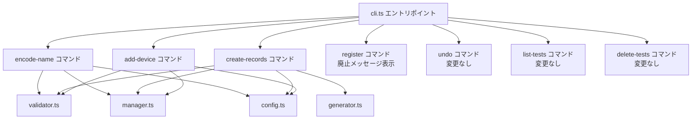
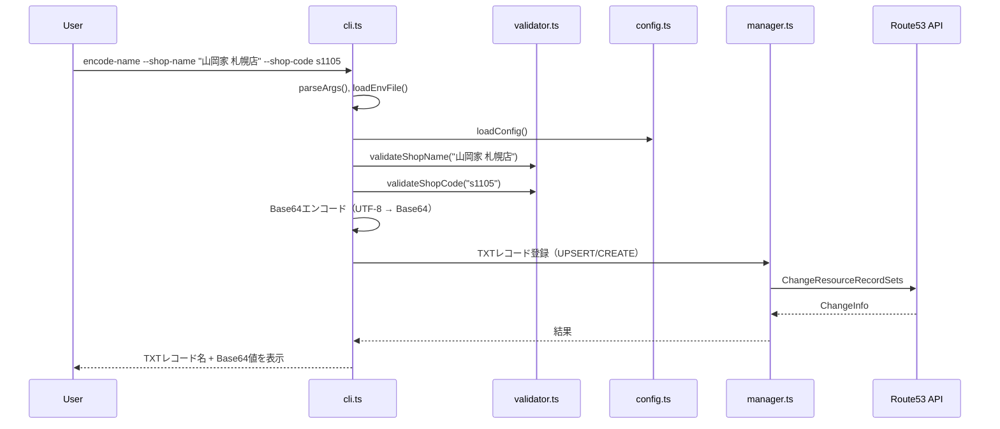
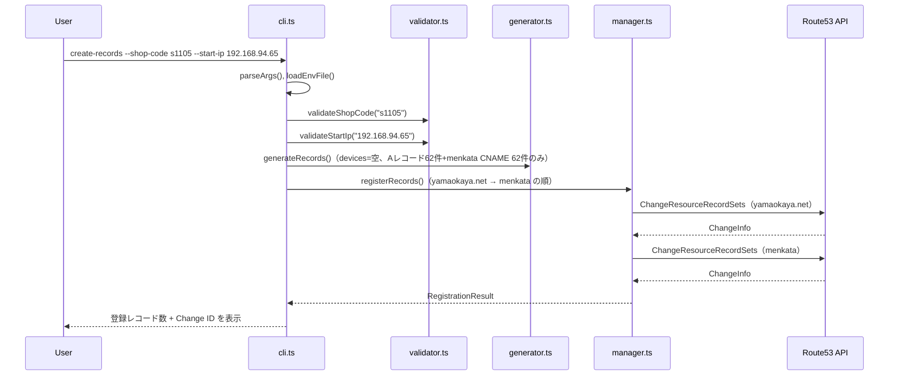
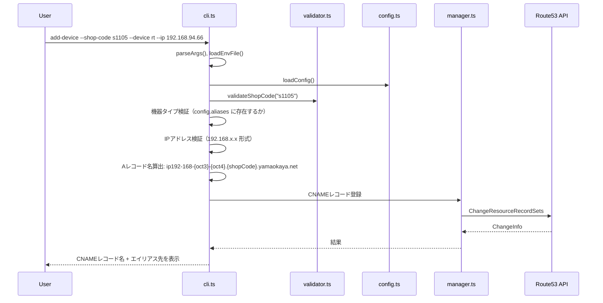

# 設計書: コマンド細分化リファクタリング

## 概要

既存の `register` コマンド（対話型 + non-interactive 一括登録）を廃止し、責務ごとに分離した3つの小さなコマンド（`encode-name`、`create-records`、`add-device`）に分解する。

### 設計方針

- 既存のビジネスロジック（validator.ts, generator.ts, manager.ts, config.ts, types.ts）は変更せず再利用する
- 新コマンドは全て non-interactive で動作し、コマンドライン引数のみで入力を受け取る
- `--env-file` と `--test` オプションは全コマンドで共通サポートする
- 対話型モジュール（interactive.ts）の register 関連関数を削除する
- CLI エントリポイント（cli.ts）を新コマンド体系に書き換える
- スキルファイル・CLAUDE.md・README.md を新コマンド体系に合わせて更新する

### 変更の影響範囲

| ファイル | 変更内容 |
|---------|---------|
| src/cli.ts | register コマンド削除、3つの新コマンド追加、廃止メッセージ追加 |
| src/interactive.ts | `promptRegisterInput`、`displayWelcome` 等の register 関連関数を削除 |
| src/generator.ts | 変更なし（既存ロジック再利用） |
| src/validator.ts | 変更なし（既存ロジック再利用） |
| src/manager.ts | 変更なし（既存ロジック再利用） |
| src/config.ts | 変更なし（既存ロジック再利用） |
| src/types.ts | 変更なし（既存型定義再利用） |
| CLAUDE.md | 新コマンド体系に更新 |
| README.md | 新コマンド体系に更新 |
| skills/*.md | 新コマンド体系に更新、YAML frontmatter 維持 |

## アーキテクチャ

### コマンド構成



### 処理フロー

各コマンドの処理フローは共通パターンに従う:

```
1. parseArgs() で引数解析
2. loadEnvFile() で環境変数読み込み（--env-file 指定時）
3. loadConfig() で設定読み込み
4. バリデーション（validator.ts の関数群）
5. ビジネスロジック実行
6. Route53 API 呼び出し（manager.ts）
7. 結果表示
```


#### encode-name コマンドフロー



#### create-records コマンドフロー



#### add-device コマンドフロー



## コンポーネントとインターフェース

### 新規コマンドハンドラ

cli.ts に以下の3つのハンドラ関数を追加する。既存の `handleRegisterNonInteractive` と `handleRegisterInteractive` は削除する。

#### handleEncodeName

```typescript
/**
 * encode-name コマンドハンドラ
 * 店舗名を UTF-8 Base64 エンコードし、TXT レコードとして登録する
 */
async function handleEncodeName(args: Record<string, string | boolean>): Promise<void>
```

引数:
| 引数 | 必須 | 型 | 説明 |
|------|------|-----|------|
| `--shop-name` | ○ | string | 店舗名（日本語） |
| `--shop-code` | ○ | string | 店舗コード（s + 数字1-6桁） |
| `--test` | - | boolean | テストモード |
| `--env-file` | - | string | 環境変数ファイルパス |

処理:
1. 必須引数チェック（`--shop-name`、`--shop-code`）
2. `validateShopName()` で店舗名検証
3. `validateShopCode()` で店舗コード検証
4. `Buffer.from(shopName, 'utf-8').toString('base64')` で Base64 エンコード
5. TXT レコード名: `{testPrefix}shopname.{shopCode}.yamaokaya.net`
6. Route53 API で TXT レコード登録（テストモード: UPSERT、本番: CREATE）
7. 登録した TXT レコード名と Base64 値を標準出力に表示

TXT レコード登録は `RecordManager` の既存メソッドでは対応できないため、cli.ts 内で直接 `ChangeResourceRecordSetsCommand` を呼び出す。TXT レコードの値は RFC に従い `"値"` の形式（ダブルクォート囲み）で登録する。

#### handleCreateRecords

```typescript
/**
 * create-records コマンドハンドラ
 * A レコード 62件 + menkata CNAME 62件を一括登録する
 */
async function handleCreateRecords(args: Record<string, string | boolean>): Promise<void>
```

引数:
| 引数 | 必須 | 型 | 説明 |
|------|------|-----|------|
| `--shop-code` | ○ | string | 店舗コード |
| `--start-ip` | ○ | string | 先頭IPアドレス |
| `--test` | - | boolean | テストモード |
| `--env-file` | - | string | 環境変数ファイルパス |

処理:
1. 必須引数チェック（`--shop-code`、`--start-ip`）
2. `validateShopCode()` で店舗コード検証
3. `validateStartIp()` で先頭IP検証
4. `generateRecords(shopCode, startIp, {}, config, testPrefix)` で A レコード 62件 + menkata CNAME 62件を生成（devices は空オブジェクト）
5. 重複チェック（テストモード以外）: `manager.checkDuplicateShopCode()`
6. `manager.registerRecords()` で登録（yamaokaya.net → menkata の順、ロールバック付き）
7. 同期確認: `manager.waitForSync()`
8. 登録レコード数と Change ID を標準出力に表示

#### handleAddDevice

```typescript
/**
 * add-device コマンドハンドラ
 * 1機器の CNAME エイリアスを登録する
 */
async function handleAddDevice(args: Record<string, string | boolean>): Promise<void>
```

引数:
| 引数 | 必須 | 型 | 説明 |
|------|------|-----|------|
| `--shop-code` | ○ | string | 店舗コード |
| `--device` | ○ | string | 機器タイプ（rt, sw, prn 等） |
| `--ip` | ○ | string | 機器IPアドレス |
| `--test` | - | boolean | テストモード |
| `--env-file` | - | string | 環境変数ファイルパス |

処理:
1. 必須引数チェック（`--shop-code`、`--device`、`--ip`）
2. `validateShopCode()` で店舗コード検証
3. 機器タイプ検証: `config.aliases.some(a => a.type === device)`
4. IPアドレス検証: `192.168.x.x` 形式チェック（正規表現）
5. A レコード名算出: IPアドレスの第3・第4オクテットを3桁ゼロパディングし、`{testPrefix}ip192-168-{oct3}-{oct4}.{shopCode}.yamaokaya.net` を生成
6. CNAME レコード名: `{testPrefix}{device}.{shopCode}.yamaokaya.net`
7. CNAME の値: 算出した A レコード名
8. Route53 API で CNAME 登録（テストモード: UPSERT、本番: UPSERT）
9. 登録した CNAME レコード名とエイリアス先を標準出力に表示

add-device は既存の A レコードに対するエイリアスを追加するため、常に UPSERT で登録する（同じ機器タイプの再登録を許容）。

### register コマンドの廃止処理

```typescript
/**
 * register コマンド廃止ハンドラ
 * 廃止メッセージと新コマンド体系の案内を表示して終了する
 */
function handleRegisterDeprecated(): void
```

表示メッセージ例:
```
register コマンドは廃止されました。以下の新しいコマンドを使用してください:

  encode-name    店舗名の Base64 エンコード・TXT レコード登録
  create-records A レコード 62件 + menkata CNAME 62件の一括登録
  add-device     機器ごとの CNAME エイリアス登録

詳細は README.md を参照してください。
```

### interactive.ts の変更

以下の関数を削除する:
- `promptRegisterInput()` — 対話型入力収集
- `displayWelcome()` — ウェルカムメッセージ表示
- `simplifyErrorMessage()` — エラーメッセージ平易化
- `displayUserFriendlyConfirmation()` — 確認サマリー表示
- `displayRegistrationProgress()` — 進捗表示
- `displayRegistrationComplete()` — 完了メッセージ表示
- `promptConfirmRegistration()` — 登録確認プロンプト
- `promptRetryOnError()` — リトライ確認プロンプト
- `promptConfirmUndo()` — undo 確認プロンプト（非対話型化のため削除）
- `promptConfirmDeleteTests()` — テストレコード削除確認プロンプト（非対話型化のため削除）
- `InteractiveInput` インターフェース

interactive.ts は全関数が削除されるため、ファイル自体を削除する。

### 共通関数（既存の再利用）

cli.ts 内の以下の関数は変更なしで全コマンドから共通利用する:
- `parseArgs()` — 引数解析
- `loadEnvFile()` — 環境変数ファイル読み込み
- `getAwsAuthErrorMessage()` — AWS認証エラー判定
- `isNetworkError()` — ネットワークエラー判定

### main() 関数のコマンドルーティング変更

```typescript
switch (command) {
  case 'encode-name':
    await handleEncodeName(args);
    break;
  case 'create-records':
    await handleCreateRecords(args);
    break;
  case 'add-device':
    await handleAddDevice(args);
    break;
  case 'register':
    handleRegisterDeprecated();
    break;
  case 'undo':
    await handleUndo(args);
    break;
  case 'list-tests':
    await handleListTests();
    break;
  case 'delete-tests':
    await handleDeleteTests(args);
    break;
  default:
    // エラーメッセージに新コマンド一覧を表示
}
```


## データモデル

### 既存型定義（変更なし）

以下の型は types.ts で定義済みであり、新コマンドからそのまま利用する:

- `Config` — 設定ファイル構造
- `AliasDefinition` — 機器タイプ定義
- `DnsRecord` — DNS レコード定義
- `GeneratedRecords` — 生成レコード群（A レコード + CNAME エイリアス + menkata CNAME）
- `ValidationResult` — バリデーション結果
- `RegistrationResult` — 登録結果
- `LastRegistration` — undo 用の直前登録情報

### TXT レコードの構造

encode-name コマンドで登録する TXT レコードは既存の `DnsRecord` 型では表現できない（type が `'A' | 'CNAME'` のみ）。TXT レコード登録は cli.ts 内で直接 Route53 API を呼び出すため、新しい型定義は追加せず、ローカル変数で処理する。

```typescript
// encode-name 内での TXT レコード構造
const txtRecordName = `${testPrefix}shopname.${shopCode}.yamaokaya.net`;
const txtRecordValue = `"${base64Value}"`;  // RFC準拠のダブルクォート囲み
const ttl = 300;
```

### A レコード名の算出ロジック（add-device 用）

add-device コマンドでは、指定された IP アドレスから対応する A レコード名を算出する。このロジックは generator.ts の `generateRecords` 内の命名規則と同一である。

```typescript
// IP: 192.168.94.66 → oct3=94, oct4=66
// A レコード名: ip192-168-094-066.s1105.yamaokaya.net
const parts = ip.split('.');
const oct3 = parts[2].padStart(3, '0');
const oct4 = parts[3].padStart(3, '0');
const aRecordName = `${testPrefix}ip192-168-${oct3}-${oct4}.${shopCode}.yamaokaya.net`;
```

### スキルファイルの構造

スキルファイルは Cowork にユーザがアップロードして使用する形式。YAML frontmatter が必須。

```yaml
---
name: スキル名
description: スキルの説明
---

# タイトル

## ルール
...

## 手順
...
```

新コマンド体系では、register-skill.md と register-test-skill.md を以下の手順に更新する:

1. encode-name で店舗名を TXT レコード登録
2. create-records で A レコード + menkata CNAME を一括登録
3. add-device で各機器の CNAME エイリアスを個別登録

各コマンドは Desktop Commander でローカル実行する指示を含める。

### CLAUDE.md / スキルファイルの運用ルール

CLAUDE.md およびスキルファイルに以下のルールを含める:

1. レコードの登録・削除・取り消しコマンドを実行する前に、必ずユーザに許可を求めること（CLI 側の確認プロンプトは廃止されたため、Cowork 側で確認する）
2. 全コマンドは Desktop Commander を用いてローカル環境で実行すること（サンドボックス内実行禁止）
3. cmd.exe を使用すること（PowerShell は使わない）
4. コマンド実行前にプロジェクトディレクトリに移動すること
5. 一時 JS ファイルの作成は行わないこと（店舗名は Base64 エンコードされるため、日本語のエンコーディング問題は発生しない）


## 正当性プロパティ（Correctness Properties）

*プロパティとは、システムの全ての有効な実行において成立すべき特性や振る舞いのことである。人間が読める仕様と機械的に検証可能な正当性保証の橋渡しとなる形式的な記述である。*

### Property 1: Base64 エンコードのラウンドトリップ

*任意の*有効な店舗名（1〜30文字、許可文字種のみ）に対して、UTF-8 バイト列として Base64 エンコードした結果をデコードすると、元の店舗名と一致する。

**Validates: Requirements 2.1**

### Property 2: 店舗名バリデーションの正確性

*任意の*文字列に対して、許可文字（漢字・ひらがな・カタカナ・英数字・スペース・長音記号・中黒）のみで構成された1〜30文字の文字列は `validateShopName` が valid を返し、禁止文字を含む文字列または空文字列または31文字以上の文字列は invalid を返す。

**Validates: Requirements 2.2, 3.4, 4.2**

### Property 3: 店舗コードバリデーションの正確性

*任意の*文字列に対して、`s` + 数字1〜6桁のパターンに一致する文字列は `validateShopCode` が valid を返し、それ以外は invalid を返す。

**Validates: Requirements 2.3, 3.4, 4.2**

### Property 4: レコード生成の不変量

*任意の*有効な店舗コードと有効な先頭IPアドレスに対して、`generateRecords` は常に A レコード 62件と menkata CNAME 62件を生成し、各 A レコードの IP アドレスは先頭IPから連番で割り当てられる。

**Validates: Requirements 3.1, 3.2**

### Property 5: IP アドレスから A レコード名算出の一貫性

*任意の*有効な店舗コードと有効な IP アドレス（192.168.x.x 形式）に対して、add-device コマンドが算出する A レコード名は、同じ店舗コード・同じ IP で `generateRecords` が生成する A レコード名と一致する。

**Validates: Requirements 4.1, 4.10**

### Property 6: IP アドレスフォーマット検証の正確性

*任意の*文字列に対して、`192.168.{0-255}.{0-255}` 形式の文字列は IP アドレス検証が valid を返し、それ以外は invalid を返す。

**Validates: Requirements 4.4**

## エラーハンドリング

### 共通エラーハンドリング方針

全コマンドで non-interactive モードのエラーハンドリング方式を採用する。技術的なエラーメッセージをそのまま標準エラー出力に表示し、終了コード 1 で終了する。

### エラー種別と対応

| エラー種別 | 判定方法 | メッセージ |
|-----------|---------|----------|
| 必須引数不足 | 引数の存在チェック | `必須引数が不足しています。{不足引数名} を指定してください。` |
| バリデーションエラー | validator.ts の各関数 | 各バリデーション関数が返すエラーメッセージ |
| 機器タイプ不正（add-device） | config.aliases との照合 | `不明な機器タイプです: {device}。使用可能: {タイプ一覧}` |
| AWS認証エラー | `getAwsAuthErrorMessage()` | 既存のメッセージ |
| ネットワークエラー | `isNetworkError()` | `インターネットに接続できません。ネットワーク接続を確認してください。` |
| Route53 API エラー | catch ブロック | `レコードの登録に失敗しました。IT部門に連絡してください。` |
| 重複レコード（create-records） | `checkDuplicateShopCode()` | `この店舗コードのレコードは既に登録されています。` |

### ロールバック戦略（create-records）

create-records コマンドは既存の `RecordManager.registerRecords()` のロールバック機構をそのまま利用する:

1. yamaokaya.net ゾーンへの登録が失敗 → エラーメッセージを表示して終了（ロールバック不要）
2. menkata ゾーンへの登録が失敗 → yamaokaya.net ゾーンのレコードを自動ロールバック（DELETE）

### encode-name / add-device のエラー処理

encode-name と add-device は単一レコードの登録のため、ロールバックは不要。Route53 API エラー時はエラーメッセージを表示して終了する。

## テスト戦略

### テストフレームワーク

- ユニットテスト: vitest（既存の設定を利用）
- プロパティベーステスト: fast-check（package.json に既に devDependencies として定義済み）

### プロパティベーステスト

各プロパティテストは最低100回のイテレーションで実行する。各テストにはデザインドキュメントのプロパティ番号を参照するタグを付与する。

タグ形式: `Feature: command-refactoring, Property {number}: {property_text}`

| プロパティ | テスト対象関数 | ジェネレータ |
|-----------|-------------|------------|
| Property 1: Base64 ラウンドトリップ | Base64 エンコード/デコード | 有効な店舗名文字列（許可文字種、1-30文字） |
| Property 2: 店舗名バリデーション | `validateShopName()` | 任意の文字列（有効/無効の両方） |
| Property 3: 店舗コードバリデーション | `validateShopCode()` | 任意の文字列（有効/無効の両方） |
| Property 4: レコード生成の不変量 | `generateRecords()` | 有効な店舗コード + 有効な先頭IP |
| Property 5: A レコード名算出の一貫性 | A レコード名算出ロジック vs `generateRecords()` | 有効な店舗コード + 有効な IP |
| Property 6: IP アドレスフォーマット検証 | IP アドレス検証ロジック | 任意の文字列（有効/無効の両方） |

### ユニットテスト（例示テスト）

プロパティテストでカバーしきれない具体的なシナリオ・エッジケース・統合ポイントをユニットテストで補完する:

| テスト対象 | テスト内容 |
|-----------|----------|
| register コマンド廃止 | 廃止メッセージが表示されること |
| encode-name 成功時出力 | TXT レコード名と Base64 値が標準出力に含まれること |
| create-records 成功時出力 | レコード数と Change ID が標準出力に含まれること |
| add-device 成功時出力 | CNAME レコード名とエイリアス先が標準出力に含まれること |
| 必須引数不足 | 各コマンドで必須引数省略時にエラーメッセージに引数名が含まれること |
| テストモード | --test 指定時にプレフィックス付きレコード名が生成されること |
| 機器タイプ不正 | 未定義の機器タイプでエラーとなること |
| AWS認証エラー | `getAwsAuthErrorMessage()` が適切なメッセージを返すこと |
| ネットワークエラー | `isNetworkError()` が適切に判定すること |

### テストファイル構成

```
src/
  __tests__/
    encode-name.test.ts      # encode-name コマンドのユニットテスト
    create-records.test.ts   # create-records コマンドのユニットテスト
    add-device.test.ts       # add-device コマンドのユニットテスト
    properties.test.ts       # 全プロパティベーステスト
    deprecated.test.ts       # register 廃止メッセージのテスト
```
