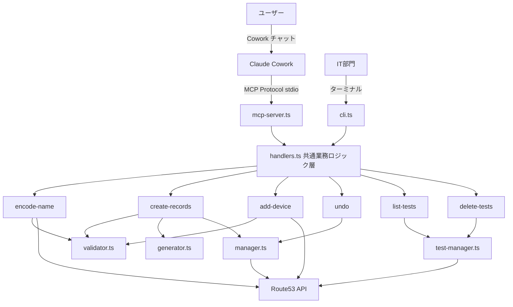
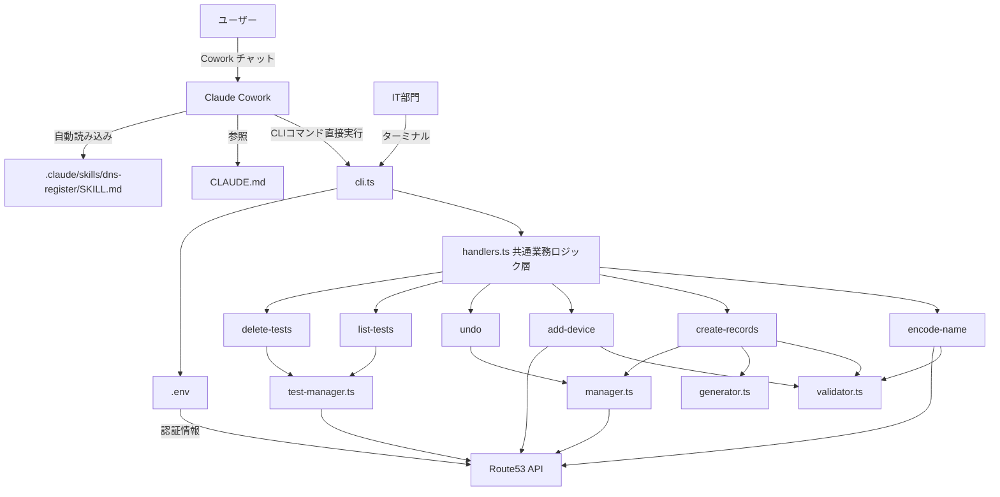

# Design Document: cowork-cli-execution

## Overview

MCPサーバー（mcp-server.ts）を廃止し、CoworkがワークスペースのCLIコマンド（`npx dns-register ...`）を直接実行するアーキテクチャに変更する。既存のCLI（cli.ts）とハンドラ層（handlers.ts）は変更不要であり、本変更はファイル削除・移動・ドキュメント更新のみで構成される。

### 設計方針

1. **MCPサーバーの完全廃止**: src/mcp-server.ts、start-mcp.bat、MCP専用依存関係（@modelcontextprotocol/sdk、zod）を削除する
2. **CLIの維持**: cli.tsとhandlers.tsは一切変更しない。Coworkが`npx dns-register <command> --env-file .env`を直接実行する
3. **スキルファイルの移行**: skills/dns-register-skill.md → .claude/skills/dns-register/SKILL.md に移動し、MCPツール呼び出しをCLIコマンド実行に書き換える
4. **ドキュメント整合性**: CLAUDE.md、README.md、docs/architecture.md、setup.batからMCPサーバーへの参照を全て削除する

### 変更の根拠

Coworkの仮想環境はCLIコマンドをネイティブに実行できるため、MCPサーバーという中間層は不要である。CLIが全コマンドを備えており、handlers.tsの業務ロジック層を直接呼び出す。MCPサーバーを廃止することで:
- 保守対象ファイルが減少する（mcp-server.ts: 約230行の削除）
- 依存関係が減少する（@modelcontextprotocol/sdk、zodの削除）
- セットアップ手順が簡素化される（Claude Desktop MCP設定が不要）
- アーキテクチャが単純化される（エントリポイントがcli.tsのみ）

## Architecture

### 変更前（現在）



### 変更後



### レイヤー構成（変更後）

```
┌─────────────────────────────────────────────┐
│  エントリポイント層                            │
│  ┌──────────────────────────────────────┐    │
│  │ cli.ts（コマンドライン）                │    │
│  │ Cowork + IT部門 共通エントリポイント     │    │
│  └──────────────┬───────────────────────┘    │
│                 │                            │
│                 ▼                            │
│  ┌──────────────────────────────────────┐    │
│  │ handlers.ts  共通業務ロジック層        │    │
│  │ - handleEncodeName()                 │    │
│  │ - handleCreateRecords()              │    │
│  │ - handleAddDevice()                  │    │
│  │ - handleUndo()                       │    │
│  │ - handleListTests()                  │    │
│  │ - handleDeleteTests()                │    │
│  └──────────────┬───────────────────────┘    │
│                 │                            │
│  ┌──────────────▼───────────────────────┐    │
│  │ 既存モジュール層（変更なし）            │    │
│  │ validator.ts | generator.ts          │    │
│  │ manager.ts   | test-manager.ts       │    │
│  │ undo.ts      | types.ts             │    │
│  └──────────────────────────────────────┘    │
└─────────────────────────────────────────────┘
```

## Components and Interfaces

### 削除対象ファイル

| ファイル | 理由 |
|---------|------|
| `src/mcp-server.ts` | MCPサーバー廃止。全機能はcli.ts経由で提供される |
| `start-mcp.bat` | MCPサーバー起動スクリプト。不要 |
| `skills/dns-register-skill.md` | .claude/skills/dns-register/SKILL.mdに移行するため削除 |

### 新規作成ファイル

#### 1. `.claude/skills/dns-register/SKILL.md` — CLIコマンド実行手順スキル

旧skills/dns-register-skill.mdの内容をCLIコマンド実行方式に書き換える。

変更点:
- 「MCPツール `setup` を呼び出し」→「`git pull && npm install && npx tsc` を実行」
- 全MCPツール呼び出し → `npx dns-register <command> --env-file .env` 形式のCLIコマンド
- テストモード: MCPの`test_mode: true` → CLIの`--test`フラグ
- undo: MCPの`undo`ツール → `npx dns-register undo --env-file .env` + `--operation-id`オプション
- delete-tests: MCPの`delete-tests`ツール → `npx dns-register delete-tests --env-file .env`
- 「Desktop Commanderは使用しない。全操作はMCPツール経由で実行すること。」→「全操作はCLIコマンド経由で実行すること。」
- skillsUpdated通知ロジックの削除（.claude/skills/配置により自動読み込みされるため不要）

CLIコマンド対応表:

| 旧（MCPツール） | 新（CLIコマンド） |
|---------------|----------------|
| `encode-name(shop_name, shop_code)` | `npx dns-register encode-name --shop-name "{SHOP_NAME}" --shop-code {SHOP_CODE} --env-file .env` |
| `encode-name(shop_name, shop_code, test_mode: true)` | `npx dns-register encode-name --test --shop-name "{SHOP_NAME}" --shop-code {SHOP_CODE} --env-file .env` |
| `create-records(shop_code, start_ip)` | `npx dns-register create-records --shop-code {SHOP_CODE} --start-ip {START_IP} --env-file .env` |
| `create-records(shop_code, start_ip, test_mode: true)` | `npx dns-register create-records --test --shop-code {SHOP_CODE} --start-ip {START_IP} --env-file .env` |
| `add-device(shop_code, device, ip)` | `npx dns-register add-device --shop-code {SHOP_CODE} --device {DEVICE_TYPE} --ip {DEVICE_IP} --env-file .env` |
| `add-device(shop_code, device, ip, test_mode: true)` | `npx dns-register add-device --test --shop-code {SHOP_CODE} --device {DEVICE_TYPE} --ip {DEVICE_IP} --env-file .env` |
| `undo()` | `npx dns-register undo --env-file .env` |
| `undo(operation_id)` | `npx dns-register undo --operation-id {OPERATION_ID} --env-file .env` |
| `list-tests()` | `npx dns-register list-tests --env-file .env` |
| `delete-tests()` | `npx dns-register delete-tests --env-file .env` |

### 既存ファイルの変更

#### 2. `CLAUDE.md` — ガイドファイル更新

変更内容:
- ツール概要: 「MCPサーバー経由で直接実行する」→「CLIコマンドを直接実行する」
- 絶対ルール: 「MCPツール `setup` を実行」→「`git pull && npm install && npx tsc` を実行」
- 絶対ルール: 「skills/フォルダ内のファイルが更新された場合〜再アップロードを促す」ルールを削除
- 絶対ルール: 「全操作はMCPツール経由で実行すること」→「全操作はCLIコマンド経由で実行すること」
- MCPツール一覧 → CLIコマンド一覧（`npx dns-register <command> --env-file .env`形式）
- 設定セクション: 「MCPサーバーが起動時に自動で読み込む」→「CLIコマンドは `--env-file .env` で認証情報を読み込む」
- 使い方セクション: skills/フォルダ参照 → .claude/skills/自動読み込みの説明に変更

#### 3. `setup.bat` — セットアップスクリプト更新

変更内容:
- Claude Desktop MCP設定セクション（ステップ4: `claude_desktop_config.json`への書き込み処理）を完全削除
- ステップ番号を調整（[1/2]、[2/2]に変更）
- 完了メッセージからMCPサーバーへの言及を削除
- Node.jsチェック、npm install、npx tscの処理は維持

#### 4. `README.md` — ユーザー向けドキュメント更新

変更内容:
- 「Claude Desktopの準備」セクション: MCP設定手順（claude_desktop_config.json編集）を削除し、Cowork仮想環境でのCLI直接実行方式を記述
- スキルファイルセクション: 「MCPサーバー（dns-register）の設定が必要です」を削除
- Cowork経由の操作説明: 「MCPツール経由で実行」→「CLIコマンド経由で実行」
- テストモードセクション: 「Cowork（MCPサーバー）経由の削除」→「Cowork（CLIコマンド）経由の削除」
- スキルファイルの登録方法セクション: 手動アップロード手順を削除し、.claude/skills/自動読み込みの説明に変更

#### 5. `docs/architecture.md` — アーキテクチャ文書更新

変更内容:
- 全体構成図: Cowork → mcp-server.ts経路を削除し、Cowork → cli.ts直接経路に変更
- レイヤー構成図: エントリポイント層からmcp-server.tsを削除
- ファイル構成: src/mcp-server.ts、start-mcp.bat、skills/dns-register-skill.mdを削除し、.claude/skills/dns-register/SKILL.mdを追加
- コマンドフロー図（MCP経由）: CLIコマンド実行方式に書き換え
- スキルファイル説明: 「MCPツール呼び出し手順スキル」→「CLIコマンド実行手順スキル」

#### 6. `package.json` — 依存関係とbin設定の更新

変更内容:
- `dependencies`から`@modelcontextprotocol/sdk`を削除
- `dependencies`から`zod`を削除（mcp-server.tsのみが使用していた）
- `bin`フィールドから`dns-register-mcp`エントリを削除

変更後のpackage.json（関連部分）:
```json
{
  "bin": {
    "dns-register": "dist/cli.js"
  },
  "dependencies": {
    "@aws-sdk/client-route-53": "^3.700.0",
    "@inquirer/prompts": "^7.0.0"
  }
}
```

### 変更なしのファイル

以下のファイルは一切変更しない:

| ファイル | 理由 |
|---------|------|
| `src/cli.ts` | 全CLIコマンドを既に備えている |
| `src/handlers.ts` | 共通業務ロジック層。エントリポイントに依存しない |
| `src/validator.ts` | バリデーションロジック。変更不要 |
| `src/generator.ts` | レコード生成ロジック。変更不要 |
| `src/manager.ts` | Route53 API操作。変更不要 |
| `src/test-manager.ts` | テストレコード管理。変更不要 |
| `src/undo.ts` | undo情報管理。変更不要 |
| `src/types.ts` | 型定義。変更不要 |

## Data Models

本変更ではデータモデルの変更は発生しない。既存の型定義（types.ts）はそのまま維持される。

CLIコマンドのインターフェースも変更なし:

| コマンド | 引数 | 説明 |
|---------|------|------|
| `encode-name` | `--shop-name`, `--shop-code`, `--test`, `--env-file` | 店舗名TXTレコード登録 |
| `create-records` | `--shop-code`, `--start-ip`, `--test`, `--env-file` | Aレコード62件+CNAME62件一括登録 |
| `add-device` | `--shop-code`, `--device`, `--ip`, `--test`, `--env-file` | 機器CNAMEエイリアス登録 |
| `undo` | `--operation-id`, `--env-file` | 登録取り消し |
| `list-tests` | `--env-file` | テストレコード一覧取得 |
| `delete-tests` | `--env-file` | テストレコード一括削除 |


## Error Handling

本変更ではコードの変更がないため、新たなエラーハンドリングの実装は不要である。既存のエラーハンドリングはそのまま維持される。

### 既存のエラーハンドリング（変更なし）

| エラー種別 | 検出方法 | エラーメッセージ | 対応 |
|-----------|---------|---------------|------|
| AWS認証未設定 | `getAwsAuthErrorMessage()` | 「AWSの認証設定がされていません。セットアップ手順を確認してください。」 | console.error + process.exit(1) |
| AWS認証期限切れ/無効 | `getAwsAuthErrorMessage()` | 「AWSの認証情報が無効です。IT部門に連絡してください。」 | console.error + process.exit(1) |
| ネットワーク接続エラー | `isNetworkError()` | 「インターネットに接続できません。ネットワーク接続を確認してください。」 | console.error + process.exit(1) |
| バリデーションエラー | validator.ts各関数 | validator.tsが返す日本語メッセージ | console.error + process.exit(1) |
| 重複レコード | RecordManager重複チェック | 「このTXTレコードは既に登録されています。」等 | console.error + process.exit(1) |
| .envファイル未指定 | cli.ts引数パース | コマンドヘルプ表示 | process.exit(1) |

### MCPサーバー廃止に伴う変更点

MCPサーバー固有のエラーハンドリング（`toMcpResponse`、`handleAwsError`関数）はmcp-server.tsの削除とともに消滅する。CLIのエラーハンドリング（cli.tsのmain関数内try-catch）がCowork経由の実行でも使用される。

Coworkの仮想環境ではCLIの標準出力・標準エラー出力がそのまま表示されるため、エラーメッセージの表示方式に変更は不要である。

## Testing Strategy

### PBT非適用の判断

本機能はプロパティベーステスト（PBT）の対象外である。理由:

1. **コード変更なし**: cli.ts、handlers.ts、その他のソースコードに変更がない
2. **ファイル操作のみ**: 変更内容はファイル削除、ファイル移動、ドキュメント内容の更新のみ
3. **入力バリエーションなし**: 各受け入れ基準は特定のファイルの存在/非存在、または特定の文言の有無を検証するもので、入力空間が存在しない
4. **純粋関数なし**: テスト対象となる新しい純粋関数が存在しない

### テスト方針

本変更は手動検証とスモークテストで十分にカバーできる。

#### スモークテスト（手動チェックリスト）

| # | 確認項目 | 対応要件 |
|---|---------|---------|
| 1 | `src/mcp-server.ts` が存在しないこと | 1.1 |
| 2 | `start-mcp.bat` が存在しないこと | 1.2 |
| 3 | `package.json` に `@modelcontextprotocol/sdk` が含まれないこと | 1.3 |
| 4 | `package.json` に `zod` が含まれないこと | 1.3 |
| 5 | `package.json` の `bin` に `dns-register-mcp` が含まれないこと | 1.3 |
| 6 | `.claude/skills/dns-register/SKILL.md` が存在すること | 2.1 |
| 7 | `skills/dns-register-skill.md` が存在しないこと | 2.8 |
| 8 | `npx tsc` がエラーなく完了すること（mcp-server.ts削除後のビルド確認） | 全体 |

#### ドキュメント内容検証（手動チェックリスト）

| # | ファイル | 確認項目 | 対応要件 |
|---|---------|---------|---------|
| 1 | SKILL.md | 全操作が `npx dns-register <command> --env-file .env` 形式であること | 2.2 |
| 2 | SKILL.md | 「MCPツール」の記述がないこと | 2.3 |
| 3 | SKILL.md | テストモードに `--test` フラグの手順があること | 2.4 |
| 4 | SKILL.md | undo に `--operation-id` の手順があること | 2.5 |
| 5 | SKILL.md | 開始時準備に `git pull && npm install && npx tsc` があること | 2.6 |
| 6 | SKILL.md | 「Desktop Commander」の記述がないこと | 2.7 |
| 7 | CLAUDE.md | CLIコマンド直接実行方式の記述があること | 3.1, 3.2 |
| 8 | CLAUDE.md | 「CLIコマンド経由で実行」の記述があること | 3.3 |
| 9 | CLAUDE.md | セットアップコマンドの記述があること | 3.4 |
| 10 | CLAUDE.md | `--env-file .env` の説明があること | 3.5 |
| 11 | CLAUDE.md | スキルファイル更新通知ルールがないこと | 3.6 |
| 12 | setup.bat | MCP設定セクションがないこと | 4.1 |
| 13 | setup.bat | Node.jsチェック、npm install、npx tscが維持されていること | 4.2 |
| 14 | setup.bat | 完了メッセージにMCPの言及がないこと | 4.3 |
| 15 | README.md | MCP設定手順がないこと | 5.1 |
| 16 | README.md | CLI直接実行方式の記述があること | 5.2 |
| 17 | README.md | 「MCPサーバーの設定が必要」の記述がないこと | 5.3 |
| 18 | README.md | 「CLIコマンド経由で実行」の記述があること | 5.4 |
| 19 | README.md | 「Cowork（CLIコマンド）経由」の記述があること | 5.5 |
| 20 | architecture.md | Cowork→cli.ts直接経路の図があること | 6.1 |
| 21 | architecture.md | mcp-server.tsがレイヤー構成図にないこと | 6.2 |
| 22 | architecture.md | ファイル構成にmcp-server.ts、start-mcp.batがないこと | 6.3 |
| 23 | architecture.md | コマンドフロー図がCLI実行方式であること | 6.4 |
| 24 | architecture.md | 「CLIコマンド実行手順スキル」の記述があること | 6.5 |

#### ビルド検証

```bash
# mcp-server.ts削除後にビルドが通ることを確認
npm install
npx tsc

# CLIコマンドが動作することを確認
npx dns-register --help
```

### 既存テストへの影響

既存のテストファイルは影響を受けない:
- `src/test-manager.bug-condition.test.ts` — test-manager.tsのテスト。変更なし
- `src/test-manager.preservation.test.ts` — test-manager.tsのテスト。変更なし

mcp-server.tsに対するテストファイルは存在しないため、削除に伴うテスト修正は不要である。
