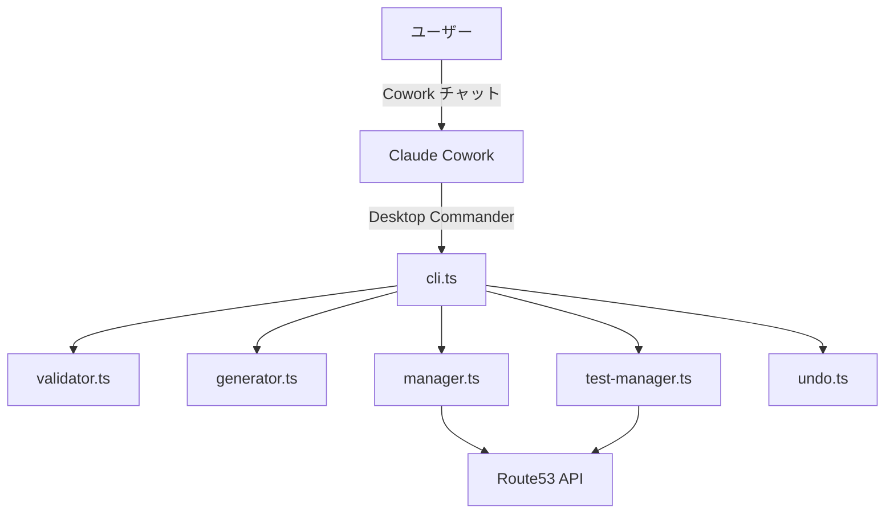
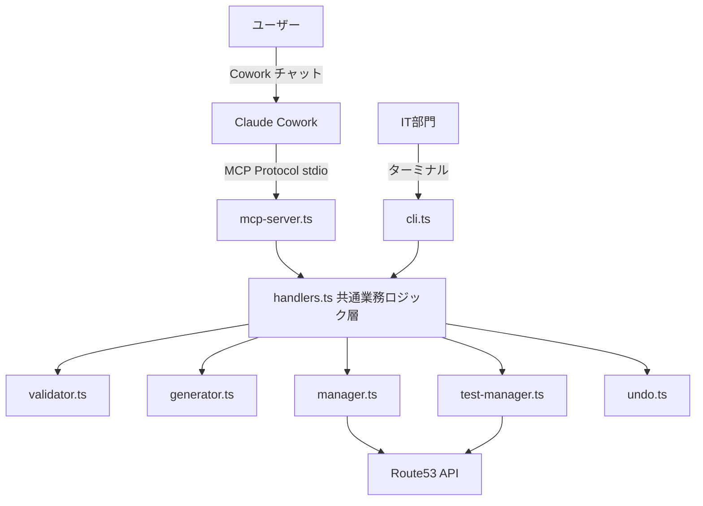

# Design Document: cowork-direct-aws

## Overview

DNS登録ツールのアーキテクチャを変更し、MCPサーバーを新設してCoworkからRoute53 APIへの直接通信パスを追加する。既存のCLIエントリポイントはデバッグ・IT部門向けに維持し、MCPサーバーとCLIの両方から共通の業務ロジック層を呼び出す構成とする。

### 設計方針

1. **共通業務ロジック層の抽出**: cli.tsに埋め込まれているハンドラロジックを独立した関数群として抽出し、MCPサーバーとCLIの両方から呼び出せるようにする
2. **既存モジュールの再利用**: validator.ts、generator.ts、manager.ts、test-manager.ts、undo.tsはそのまま維持する
3. **MCPサーバーの新設**: `@modelcontextprotocol/sdk`を使用し、stdioトランスポートでClaude Desktopと通信する
4. **CLIの簡素化**: cli.tsは共通業務ロジック層を呼び出し、結果をコンソール出力するだけの薄いラッパーに変更する
5. **encode-nameのBase64内部化**: `--shop-name-base64`パラメータを廃止し、平文の店舗名からツール内部でBase64エンコードを実行する

### 調査結果

MCP TypeScript SDK（`@modelcontextprotocol/sdk`）の調査結果:
- `McpServer`クラスと`StdioServerTransport`を使用してstdioベースのMCPサーバーを構築できる（[公式ドキュメント](https://ts.sdk.modelcontextprotocol.io/documents/server.html)）
- ツール登録は`server.registerTool(name, schema, handler)`で行い、入力スキーマはZodで定義する
- エラーハンドリングは`isError: true`フラグで返却する
- Claude DesktopはstdioトランスポートでローカルプロセスとしてMCPサーバーを起動する

## Architecture

### 変更前（現在）



### 変更後



### レイヤー構成

```
┌─────────────────────────────────────────────┐
│  エントリポイント層                            │
│  ┌──────────────┐  ┌──────────────────────┐  │
│  │ mcp-server.ts│  │ cli.ts               │  │
│  │ (MCP Protocol)│  │ (コマンドライン)       │  │
│  └──────┬───────┘  └──────────┬───────────┘  │
│         │                     │              │
│         ▼                     ▼              │
│  ┌──────────────────────────────────────┐    │
│  │ handlers.ts  共通業務ロジック層        │    │
│  │ - handleEncodeName()                 │    │
│  │ - handleCreateRecords()              │    │
│  │ - handleAddDevice()                  │    │
│  │ - handleUndo()                       │    │
│  │ - handleListTests()                  │    │
│  │ - handleDeleteTests()                │    │
│  └──────────────┬───────────────────────┘    │
│                 │                            │
│  ┌──────────────▼───────────────────────┐    │
│  │ 既存モジュール層（変更なし）            │    │
│  │ validator.ts | generator.ts          │    │
│  │ manager.ts   | test-manager.ts       │    │
│  │ undo.ts      | types.ts             │    │
│  └──────────────────────────────────────┘    │
└─────────────────────────────────────────────┘
```

## Components and Interfaces

### 新規ファイル

#### 1. `src/handlers.ts` — 共通業務ロジック層

cli.tsから抽出した業務ロジックを関数として公開する。各関数は構造化された結果オブジェクトを返し、副作用（console.log、process.exit）を持たない。

```typescript
/** encode-name の入力パラメータ */
interface EncodeNameParams {
  shopName: string;
  shopCode: string;
  testMode: boolean;
}

/** encode-name の実行結果 */
interface EncodeNameResult {
  success: boolean;
  txtRecordName?: string;
  base64Value?: string;
  error?: string;
}

/** create-records の入力パラメータ */
interface CreateRecordsParams {
  shopCode: string;
  startIp: string;
  testMode: boolean;
}

/** create-records の実行結果 */
interface CreateRecordsResult {
  success: boolean;
  recordCount?: number;
  yamaokayaChangeId?: string;
  menkataChangeId?: string;
  error?: string;
}

/** add-device の入力パラメータ */
interface AddDeviceParams {
  shopCode: string;
  device: string;
  ip: string;
  testMode: boolean;
}

/** add-device の実行結果 */
interface AddDeviceResult {
  success: boolean;
  cnameRecordName?: string;
  aliasTarget?: string;
  error?: string;
}

/** undo の実行結果 */
interface UndoResult {
  success: boolean;
  message: string;
  shopCode?: string;
  shopName?: string;
}

/** list-tests の実行結果 */
interface ListTestsResult {
  yamaokayaRecords: DnsRecord[];
  menkataRecords: DnsRecord[];
  totalCount: number;
}

/** delete-tests の実行結果 */
interface DeleteTestsResult {
  deletedCount: number;
  failedCount: number;
  failures: Array<{ name: string; reason: string }>;
}
```

各ハンドラ関数のシグネチャ:

```typescript
function handleEncodeName(params: EncodeNameParams, route53Client: Route53Client, config: Config): Promise<EncodeNameResult>
function handleCreateRecords(params: CreateRecordsParams, route53Client: Route53Client, config: Config): Promise<CreateRecordsResult>
function handleAddDevice(params: AddDeviceParams, route53Client: Route53Client, config: Config): Promise<AddDeviceResult>
function handleUndo(route53Client: Route53Client, config: Config): Promise<UndoResult>
function handleListTests(route53Client: Route53Client, config: Config): Promise<ListTestsResult>
function handleDeleteTests(route53Client: Route53Client, config: Config): Promise<DeleteTestsResult>
```

設計判断: Route53ClientとConfigを引数として受け取る設計にすることで、テスト時にモックを注入しやすくし、MCPサーバーとCLIで同一のインスタンスを共有できる。

#### 2. `src/mcp-server.ts` — MCPサーバーエントリポイント

`@modelcontextprotocol/sdk`を使用し、stdioトランスポートでMCPサーバーを起動する。

```typescript
import { McpServer } from '@modelcontextprotocol/sdk/server/mcp.js';
import { StdioServerTransport } from '@modelcontextprotocol/sdk/server/stdio.js';
import { z } from 'zod';
```

起動時の処理:
1. .envファイルからAWS認証情報を読み込む
2. Route53Clientを初期化する
3. Configオブジェクトを構築する
4. 6つのツールを登録する
5. StdioServerTransportで接続する

エラーハンドリング:
- 各ツールハンドラ内でhandlers.tsの関数を呼び出し、結果をMCPレスポンス形式に変換する
- AWS認証エラー・ネットワークエラーはcli.tsの`getAwsAuthErrorMessage`/`isNetworkError`を再利用する
- ハンドラが返すerrorフィールドはそのまま`isError: true`で返却する

### 既存ファイルの変更

#### 3. `src/cli.ts` — CLIエントリポイント（リファクタリング）

変更内容:
- 各コマンドハンドラの業務ロジックをhandlers.tsの関数呼び出しに置き換える
- `--shop-name-base64`パラメータを廃止し、`--shop-name`のみ受け付ける
- `getAwsAuthErrorMessage`と`isNetworkError`はcli.tsに残す（MCPサーバーからもimportして再利用）
- コンソール出力とprocess.exitの制御はcli.tsに残す

#### 4. `skills/dns-register-skill.md` — スキルファイル更新

変更内容:
- Desktop Commanderの`execute_command`呼び出しをMCPツール呼び出しに置き換える
- `npx dns-register`コマンドの記述を排除する
- Base64エンコード手順の記述を排除する
- `--env-file .env`の記述を排除する
- ユーザー許可確認の手順は維持する
- 「Desktop Commanderは使用しない。全操作はMCPツール経由で実行すること。」という禁止ルールを絶対ルールセクションに明記する

#### 5. `CLAUDE.md` — ガイドファイル更新

変更内容:
- 「Desktop Commander でローカル実行」を「MCPサーバー経由で直接実行」に置き換える
- コマンド一覧をMCPツール名とパラメータに更新する
- `--env-file .env`の記述を排除する

### MCPツール定義

| ツール名 | パラメータ | 説明 |
|---------|----------|------|
| `encode-name` | `shop_name: string, shop_code: string, test_mode?: boolean` | 店舗名TXTレコード登録 |
| `create-records` | `shop_code: string, start_ip: string, test_mode?: boolean` | Aレコード62件+CNAME62件一括登録 |
| `add-device` | `shop_code: string, device: string, ip: string, test_mode?: boolean` | 機器CNAMEエイリアス登録 |
| `undo` | なし | 直前の登録取り消し |
| `list-tests` | なし | テストレコード一覧取得 |
| `delete-tests` | なし | テストレコード一括削除 |

設計判断: MCPツールのパラメータ名はsnake_case（MCP慣例）を採用する。CLIの`--shop-code`に対応する`shop_code`のように、ハイフンをアンダースコアに変換する。

## Data Models

### 新規型定義（`src/types.ts`に追加）

handlers.tsの入出力型は`src/types.ts`に追加する。既存の型定義（Config、DnsRecord、GeneratedRecords、ValidationResult、RegistrationResult、LastRegistration）はそのまま維持する。

```typescript
/** encode-name ハンドラの入力 */
export interface EncodeNameParams {
  shopName: string;
  shopCode: string;
  testMode: boolean;
}

/** encode-name ハンドラの出力 */
export interface EncodeNameResult {
  success: boolean;
  txtRecordName?: string;
  base64Value?: string;
  error?: string;
}

/** create-records ハンドラの入力 */
export interface CreateRecordsParams {
  shopCode: string;
  startIp: string;
  testMode: boolean;
}

/** create-records ハンドラの出力 */
export interface CreateRecordsResult {
  success: boolean;
  recordCount?: number;
  yamaokayaChangeId?: string;
  menkataChangeId?: string;
  error?: string;
}

/** add-device ハンドラの入力 */
export interface AddDeviceParams {
  shopCode: string;
  device: string;
  ip: string;
  testMode: boolean;
}

/** add-device ハンドラの出力 */
export interface AddDeviceResult {
  success: boolean;
  cnameRecordName?: string;
  aliasTarget?: string;
  error?: string;
}

/** undo ハンドラの出力 */
export interface UndoResult {
  success: boolean;
  message: string;
  shopCode?: string;
  shopName?: string;
}

/** list-tests ハンドラの出力 */
export interface ListTestsResult {
  yamaokayaRecords: DnsRecord[];
  menkataRecords: DnsRecord[];
  totalCount: number;
}

/** delete-tests ハンドラの出力 */
export interface DeleteTestsResult {
  deletedCount: number;
  failedCount: number;
  failures: Array<{ name: string; reason: string }>;
}
```

### Claude Desktop設定（`claude_desktop_config.json`への追記）

```json
{
  "mcpServers": {
    "dns-register": {
      "command": "node",
      "args": ["dist/mcp-server.js"],
      "cwd": "/path/to/route53_dns_auto_register"
    }
  }
}
```


## Correctness Properties

*プロパティとは、システムの全ての有効な実行において成立すべき特性や振る舞いのことである。要件を人間が読める仕様から機械的に検証可能な正しさの保証へと橋渡しする役割を果たす。*

### Property 1: Base64エンコードのラウンドトリップ

*For any* 有効な店舗名（1-30文字、許可文字種のみ）と有効な店舗コード（s + 数字1-6桁）に対して、handleEncodeNameが返すbase64ValueをBase64デコードした結果は、入力した店舗名と完全一致すること。また、txtRecordNameは`{shopCode}.yamaokaya.net`の形式であること。

**Validates: Requirements 3.5, 4.1, 4.5**

### Property 2: テストモードのプレフィックス付与

*For any* 有効な店舗コードに対して、testMode=trueの場合にhandleEncodeNameが返すtxtRecordNameは`__dns_auto_test-{shopCode}.yamaokaya.net`の形式で始まること。testMode=falseの場合は`__dns_auto_test-`プレフィックスを含まないこと。

**Validates: Requirements 4.3**

### Property 3: create-recordsのレコード数整合性

*For any* 有効な店舗コードと有効な先頭IPアドレス（192.168.x.x形式、第4オクテット+61<=254）に対して、handleCreateRecordsが返すrecordCountは124（Aレコード62件 + menkata CNAME 62件）であること。

**Validates: Requirements 5.1, 5.3**

### Property 4: add-deviceのAレコード名算出

*For any* 有効な店舗コード、任意の機器タイプ文字列、有効なIPアドレス（192.168.x.x形式）に対して、handleAddDeviceが返すaliasTargetは`ip192-168-{oct3_3桁}-{oct4_3桁}.{shopCode}.yamaokaya.net`の形式であり、cnameRecordNameは`{device}.{shopCode}.yamaokaya.net`の形式であること。

**Validates: Requirements 6.1, 6.3**

### Property 5: バリデーション透過性

*For any* 文字列入力に対して、handleEncodeNameが店舗名バリデーションで返すエラーメッセージはvalidateShopNameが返すエラーメッセージと完全一致すること。同様に、handleCreateRecordsが店舗コード・先頭IPバリデーションで返すエラーメッセージはvalidateShopCode・validateStartIpが返すエラーメッセージと完全一致すること。

**Validates: Requirements 10.1, 10.2, 10.3, 10.4**

## Error Handling

### エラー分類と対応

| エラー種別 | 検出方法 | エラーメッセージ | 対応 |
|-----------|---------|---------------|------|
| AWS認証未設定 | `getAwsAuthErrorMessage()` | 「AWSの認証設定がされていません。セットアップ手順を確認してください。」 | MCPレスポンスで`isError: true`を返却 |
| AWS認証期限切れ/無効 | `getAwsAuthErrorMessage()` | 「AWSの認証情報が無効です。IT部門に連絡してください。」 | MCPレスポンスで`isError: true`を返却 |
| ネットワーク接続エラー | `isNetworkError()` | 「インターネットに接続できません。ネットワーク接続を確認してください。」 | MCPレスポンスで`isError: true`を返却 |
| バリデーションエラー | Input_Validator各関数 | validator.tsが返す日本語メッセージ | ハンドラ結果の`error`フィールドで返却 |
| 重複レコード | RecordManager重複チェック | 「このTXTレコードは既に登録されています。」等 | ハンドラ結果の`error`フィールドで返却 |
| .envファイル不在 | fs.existsSync | 「.envファイルが見つかりません。」 | MCPサーバー起動時にエラー返却 |
| menkata登録失敗 | RecordManager.registerRecords | 「登録処理の途中でエラーが発生したため...」 | 自動ロールバック後にエラー返却 |

### エラーハンドリングの実装方針

1. **handlers.ts**: 業務ロジックのエラーは`{ success: false, error: "メッセージ" }`形式で返す。例外はスローしない。
2. **mcp-server.ts**: handlers.tsの結果を受け取り、`success: false`の場合は`isError: true`でMCPレスポンスを返す。AWS認証エラー・ネットワークエラーはtry-catchで捕捉し、`getAwsAuthErrorMessage`/`isNetworkError`で判定する。
3. **cli.ts**: handlers.tsの結果を受け取り、`success: false`の場合は`console.error`で出力し`process.exit(1)`する。

### エラー判定関数の共有

`getAwsAuthErrorMessage`と`isNetworkError`はcli.tsからexportし、mcp-server.tsからimportして再利用する。これにより、エラー判定ロジックの重複を排除する。

## Testing Strategy

### テスト方針

本機能は既存の業務ロジック（validator.ts、generator.ts、manager.ts等）を再利用する設計のため、テストの焦点は以下に置く:

1. **共通業務ロジック層（handlers.ts）の正しさ**: 入力パラメータの受け渡し、バリデーション呼び出し、結果の構造化
2. **MCPサーバーのツール登録と呼び出し**: ツールが正しく登録され、ハンドラが呼び出されること
3. **CLIのリファクタリング後の後方互換性**: 既存コマンドが引き続き動作すること

### テスト構成

#### プロパティベーステスト（fast-check使用）

プロジェクトには既に`fast-check`が導入されている。各プロパティテストは最低100回のイテレーションで実行する。

| テストファイル | 対象プロパティ | 説明 |
|-------------|-------------|------|
| `src/handlers.test.ts` | Property 1-5 | handlers.tsの共通業務ロジック層のプロパティテスト |

各テストには以下のタグ形式でコメントを付与する:
`Feature: cowork-direct-aws, Property {number}: {property_text}`

#### ユニットテスト（vitest使用）

| テストファイル | 対象 | 説明 |
|-------------|------|------|
| `src/handlers.test.ts` | handlers.ts | 重複チェック、undo、エラーハンドリングの具体例テスト |
| `src/mcp-server.test.ts` | mcp-server.ts | ツール登録確認、MCPレスポンス形式の確認 |

#### インテグレーションテスト

| テストファイル | 対象 | 説明 |
|-------------|------|------|
| `src/mcp-server.test.ts` | mcp-server.ts | MCPプロトコル経由でのツール呼び出しが業務ロジックに到達することの確認 |

### モック戦略

- **Route53Client**: 全テストでモック化。AWS APIへの実際の呼び出しは行わない。
- **undo.ts**: ファイルI/Oをモック化し、saveLastRegistration/loadLastRegistrationの呼び出しを検証する。
- **.envファイル**: テスト用の環境変数をprocess.envに直接設定する。

### 既存テストとの関係

既存のテストファイル（`test-manager.bug-condition.test.ts`、`test-manager.preservation.test.ts`）はtest-manager.tsの動作を検証しており、本変更の影響を受けない。handlers.tsはtest-manager.tsを呼び出すだけであり、test-manager.tsの内部ロジックは変更しない。
