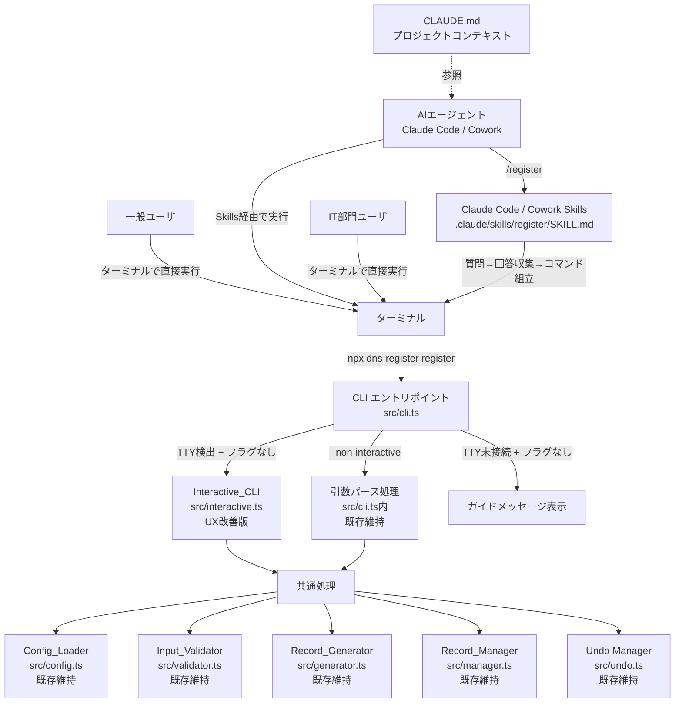
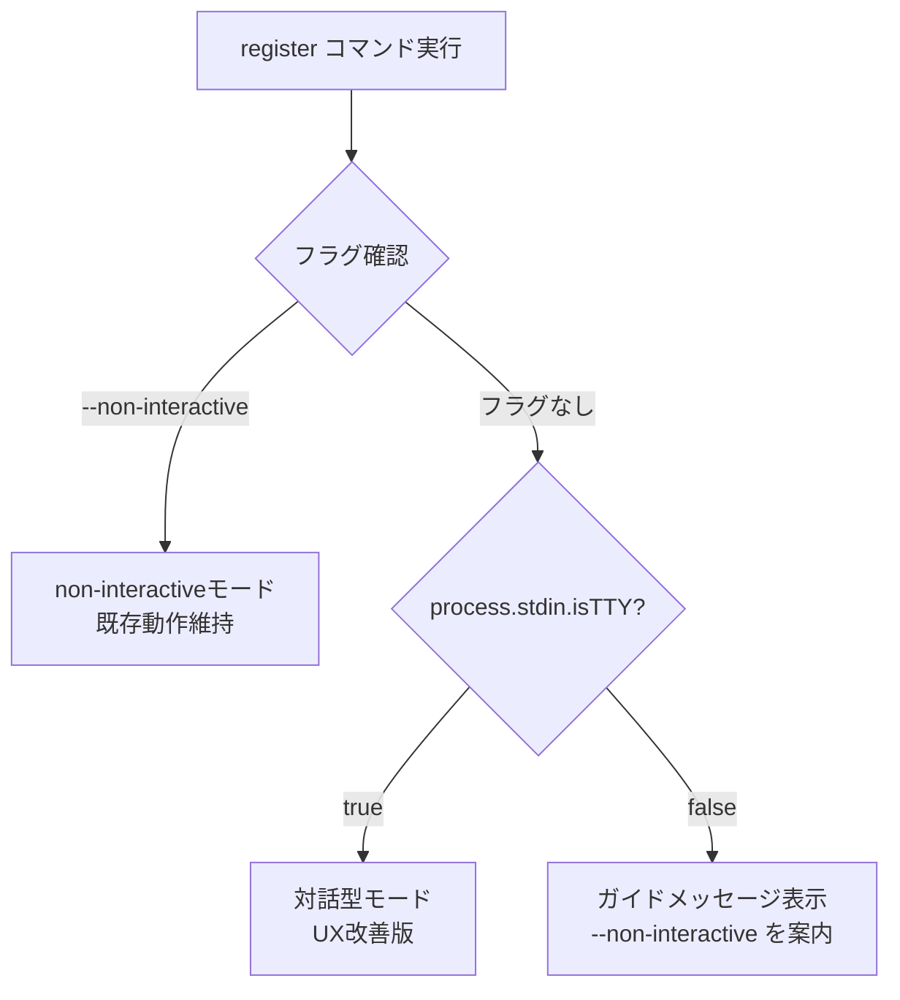
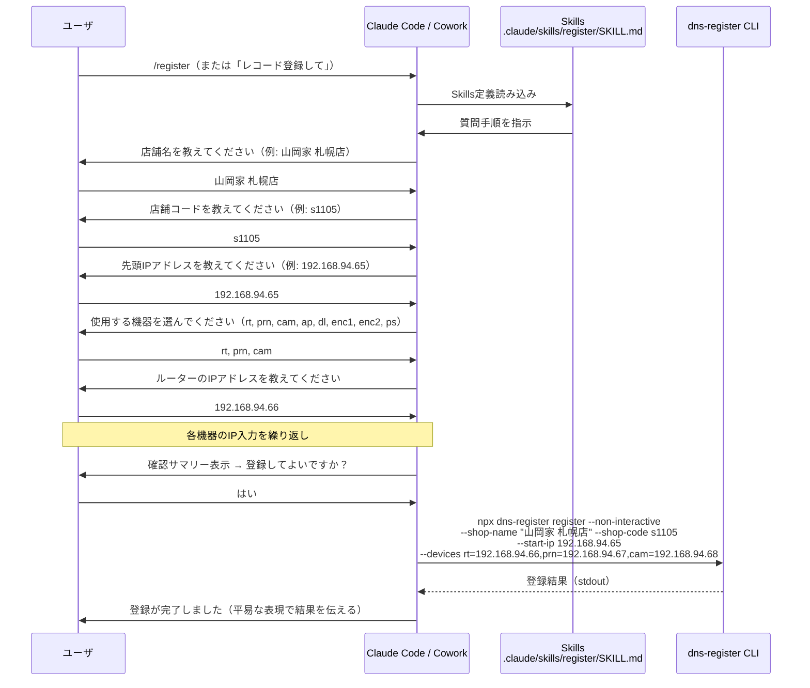
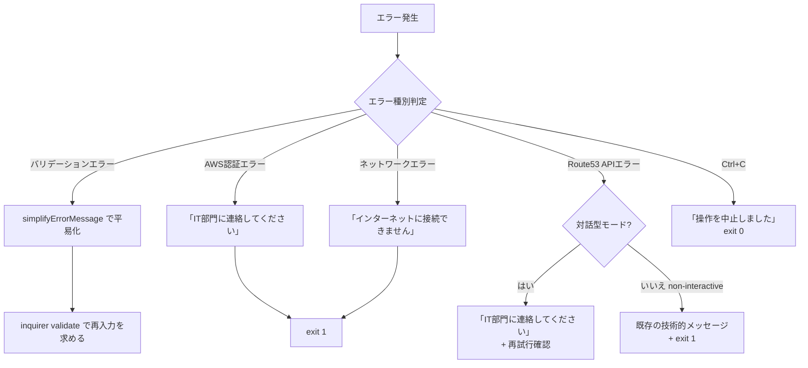

# 設計書: 非IT部門ユーザ向け対応

## 概要

本設計書は、既存のRoute53 DNS登録CLIツール（dns-register）を非IT部門の一般ユーザにも使いやすくするための改善を定義する。改善は以下の4領域にわたる:

1. **対話型プロンプトのUX改善**（`src/interactive.ts`、`src/cli.ts`）: ウェルカムメッセージ、ステップ番号表示、入力例、エラーメッセージの平易化、進捗表示、確認画面の改善
2. **Claude Code / Cowork Skills による対話型フロー**（`.claude/skills/`、`CLAUDE.md`）: AIエージェント環境向けに、Skills ファイル（SKILL.md）がユーザに順番に質問し、収集した入力値から `--non-interactive` コマンドを組み立てて実行する。Agent Skills オープンスタンダードに準拠し、Claude Code（ターミナル）と Cowork（デスクトップ）の両方で動作する。ツール側に新しいTypeScriptコードは不要
3. **READMEの再構成**（`README.md`）: 冒頭に一般ユーザ向けセクション、末尾にIT部門向け技術情報を配置
4. **セットアップスクリプトの改善**（`setup.bat`、`setup.sh`）: 前提ソフトウェアの自動チェック強化、ブラウザ自動起動、AWS認証設定の案内

設計方針:
- 既存のビジネスロジック（validator.ts、generator.ts、manager.ts、test-manager.ts、undo.ts、config.ts）は一切変更しない
- non-interactiveモードの動作は変更しない（IT部門・CI/CD向けのまま維持）
- 対話型モードのエラーメッセージ平易化は `interactive.ts` と `cli.ts` のUI層で吸収する（バリデータの戻り値を変換）
- AIエージェント連携は Claude Code / Cowork Skills（`.claude/skills/<skill-name>/SKILL.md`）と `CLAUDE.md` で実現する。新しいTypeScriptモジュールの追加は不要。Skills がユーザに対話的に質問し、既存の `--non-interactive` コマンドを組み立てて実行する
- CLIのモード分岐は2モード（対話型 / non-interactive）+ TTY検出のみ
- すべての出力メッセージは日本語
- 各ファイルは500行以内に収める

## アーキテクチャ

### 全体構成



### CLIモード分岐フロー



### Claude Code / Cowork Skills フロー



### ディレクトリ構成

```
project-root/
├── .claude/
│   └── skills/
│       ├── register/
│       │   └── SKILL.md            # Skills: レコード登録フロー【新規】
│       ├── undo/
│       │   └── SKILL.md            # Skills: 登録取り消し【新規】
│       └── register-test/
│           └── SKILL.md            # Skills: テストモード登録【新規】
├── src/
│   ├── cli.ts              # CLIエントリポイント（TTY検出追加）【変更】
│   ├── interactive.ts      # Interactive_CLI（UX改善: ウェルカム、ステップ番号、入力例、エラー平易化）【変更】
│   ├── config.ts           # Config_Loader【既存維持】
│   ├── validator.ts        # Input_Validator【既存維持】
│   ├── generator.ts        # Record_Generator【既存維持】
│   ├── manager.ts          # Record_Manager【既存維持】
│   ├── test-manager.ts     # Test_Record_Manager【既存維持】
│   ├── undo.ts             # Undo Manager【既存維持】
│   └── types.ts            # 型定義【既存維持・変更なし】
├── CLAUDE.md               # Claude Code / Cowork プロジェクトコンテキスト【新規】
├── config.json             # 設定ファイル【既存維持】
├── README.md               # 一般ユーザ向け + IT部門向けに再構成【変更】
├── setup.bat               # Windowsセットアップ（ブラウザ自動起動、AWS案内追加）【変更】
├── setup.sh                # macOS/Linuxセットアップ（同上）【変更】
├── package.json            # 変更なし
└── tsconfig.json           # 変更なし
```

変更対象ファイルの概要:
- `src/cli.ts` — 変更。TTY自動検出ロジック追加、対話型モードのUX改善呼び出し、エラーメッセージ平易化
- `src/interactive.ts` — 変更。ウェルカムメッセージ、ステップ番号、入力例、エラー平易化関数、確認画面改善、進捗表示
- `src/types.ts` — 変更なし（新しい型の追加は不要）
- `.claude/skills/register/SKILL.md` — 新規。Skills 定義（レコード登録フロー）
- `.claude/skills/undo/SKILL.md` — 新規。Skills 定義（登録取り消し）
- `.claude/skills/register-test/SKILL.md` — 新規。Skills 定義（テストモード登録）
- `CLAUDE.md` — 新規。Claude Code / Cowork プロジェクトコンテキストガイド
- `README.md` — 変更。一般ユーザ向け + IT部門向けに再構成
- `setup.bat` / `setup.sh` — 変更。ブラウザ自動起動、AWS認証案内追加


## コンポーネントとインターフェース

### 1. CLI エントリポイント (`src/cli.ts`)【変更】

既存の `cli.ts` に以下の変更を加える:

- `register` コマンドのモード分岐を2モード（対話型 / non-interactive）+ TTY検出に変更
- TTY自動検出ロジックの追加（`process.stdin.isTTY` チェック）
- 対話型モードの `handleRegisterInteractive` にUX改善を反映（ウェルカムメッセージ呼び出し、進捗表示、確認画面改善、エラーメッセージ平易化）
- `handleUndo` のメッセージを一般ユーザ向けに平易化
- `handleDeleteTests` のメッセージを一般ユーザ向けに平易化
- Ctrl+Cメッセージの平易化

```typescript
// register コマンドの2モード分岐 + TTY検出
case 'register':
  if (args['non-interactive']) {
    await handleRegisterNonInteractive(args);  // 既存動作維持
  } else if (process.stdin.isTTY) {
    await handleRegisterInteractive(args);  // UX改善版
  } else {
    // TTY未接続時のガイドメッセージ
    console.log('対話型モードが使用できない環境です。以下の方法で実行してください:');
    console.log('  - 一括指定: register --non-interactive --shop-name ...');
    process.exit(1);
  }
  break;
```

設計判断:
- 対話型モードのエラーメッセージ平易化は、バリデータの戻り値をそのまま使わず、`interactive.ts` の `validate` コールバック内でラップして平易な表現に変換する
- non-interactiveモードのエラーメッセージは既存のまま維持（IT部門向け）
- AIエージェント連携は Claude Code / Cowork Skills が `--non-interactive` コマンドを組み立てて実行するため、CLI側に新しいモードは不要

### 2. Interactive_CLI (`src/interactive.ts`)【変更】

既存の `interactive.ts` に以下のUX改善を加える:

#### ウェルカムメッセージ

```typescript
/** ウェルカムメッセージを表示する */
export function displayWelcome(testMode: boolean): void {
  console.log('\n========================================');
  console.log('  店舗ネットワーク設定 登録ツール');
  console.log('========================================');
  console.log('このツールは、新しい店舗のネットワーク設定を登録します。');
  console.log('以下の5つのステップで入力を進めます:');
  console.log('  1. 店舗名の入力');
  console.log('  2. 店舗コードの入力');
  console.log('  3. 先頭IPアドレスの入力');
  console.log('  4. 使用する機器の選択');
  console.log('  5. 各機器のIPアドレスの入力');
  if (testMode) {
    console.log('\n  ※ テストモードで実行中です。本番環境には影響しません。');
  }
  console.log('========================================\n');
}
```

#### ステップ番号付きプロンプト

各プロンプトの `message` にステップ番号を付与する:

```typescript
// 例: ステップ1
const shopName = await input({
  message: '[ステップ 1/5] 店舗名を入力してください（例: 山岡家 札幌店）:',
  validate: (value: string) => {
    const result = validateShopName(value);
    if (result.valid) return true;
    return simplifyErrorMessage(result.error ?? '入力が不正です。');
  },
});
```

#### エラーメッセージ平易化関数

バリデータの技術的なエラーメッセージを一般ユーザ向けに変換する:

```typescript
/** バリデーションエラーメッセージを一般ユーザ向けに平易化する */
export function simplifyErrorMessage(error: string): string {
  // サブネット境界エラー
  if (error.includes('62件のレコード')) {
    return 'このIPアドレスでは登録に必要な数のレコードを作成できません。ネットワーク設計書を確認し、別のIPアドレスを入力してください。';
  }
  // 範囲外エラー
  if (error.includes('範囲外')) {
    return 'このIPアドレスは、この店舗に割り当てられた範囲の外です。ネットワーク設計書を確認してください。';
  }
  // IPフォーマットエラー
  if (error.includes('192.168.x.x')) {
    return 'IPアドレスが正しくありません。例: 192.168.94.65 の形式で入力してください。';
  }
  // その他はそのまま返す（元々日本語で平易なもの）
  return error;
}
```

#### 入力例と補足説明

各プロンプトに入力例と補足説明を含める:

```typescript
// ステップ2: 店舗コード
const shopCode = await input({
  message: '[ステップ 2/5] 店舗コードを入力してください（例: s1105）\n  店舗コードは店舗一覧表で確認できます:',
  validate: ...
});

// ステップ3: 先頭IPアドレス
const startIp = await input({
  message: '[ステップ 3/5] 先頭IPアドレスを入力してください（例: 192.168.94.65）\n  IPアドレスはネットワーク設計書で確認できます:',
  validate: ...
});

// ステップ4: 機器選択
const selectedDevices = await checkbox({
  message: '[ステップ 4/5] 使用する機器を選択してください\n  スペースキーで選択/解除、Enterキーで確定:',
  ...
});

// ステップ5: 各機器IP
const deviceIp = await input({
  message: `[ステップ 5/5] ${displayName}（${deviceType}）のIPアドレスを入力してください（例: 192.168.94.66）:`,
  validate: ...
});
```

#### 確認画面の改善

```typescript
/** 一般ユーザ向け確認サマリーを表示する */
export function displayUserFriendlyConfirmation(
  shopName: string,
  shopCode: string,
  startIp: string,
  devices: Record<string, string>,
  aliasMap: Map<string, string>
): void {
  console.log('\n========================================');
  console.log('  登録内容の確認');
  console.log('========================================');
  console.log(`  店舗名:         ${shopName}`);
  console.log(`  店舗コード:     ${shopCode}`);
  console.log(`  先頭IPアドレス: ${startIp}`);
  console.log('  選択した機器:');
  for (const [type, ip] of Object.entries(devices)) {
    const name = aliasMap.get(type) ?? type;
    console.log(`    - ${name}: ${ip}`);
  }
  console.log('========================================\n');
}
```

#### 進捗表示の改善

```typescript
/** 登録処理の進捗を表示する */
export function displayRegistrationProgress(step: number, total: number, message: string): void {
  console.log(`[${step}/${total}] ${message}`);
}

/** 登録完了メッセージを表示する */
export function displayRegistrationComplete(shopName: string, shopCode: string): void {
  console.log('\n========================================');
  console.log('  登録が完了しました');
  console.log('========================================');
  console.log(`${shopName}（${shopCode}）のネットワーク設定が反映されました。`);
  console.log('\n登録を間違えた場合は、30分以内に以下のコマンドを実行してください:');
  console.log('  npx dns-register undo');
  console.log('========================================\n');
}
```

設計判断:
- `simplifyErrorMessage` は `interactive.ts` からエクスポートする（テスト可能にするため）
- ステップ番号は固定値（1/5〜5/5）。機器IPの入力は「ステップ5」として統合（機器数に関わらず）
- 確認画面ではAレコード件数・CNAME件数等の技術情報を非表示にし、店舗名・店舗コード・IP・機器一覧のみ表示

### 3. Claude Code / Cowork Skills ファイル【新規】

Skills は `.claude/skills/<skill-name>/SKILL.md` 形式で配置する。各ファイルは Agent Skills オープンスタンダードに準拠し、Claude Code（ターミナル）と Cowork（デスクトップ）の両方でスラッシュコマンドとして機能する。ユーザに対話的に質問して入力を収集し、最終的に `--non-interactive` コマンドを組み立てて実行する。

**重要な設計判断**: AIエージェント連携のために新しいTypeScriptコードは一切不要。Skills がユーザとの対話を担当し、既存の `--non-interactive` モードを活用する。

#### 3.1 `.claude/skills/register/SKILL.md`（レコード登録）

```markdown
---
name: register
description: 店舗のネットワーク設定（DNSレコード）を登録する。「レコード登録」「店舗登録」「新しい店舗」等の依頼時に使用する
disable-model-invocation: false
---

# レコード登録

店舗のネットワーク設定（DNSレコード）を登録します。

## 手順

ユーザに以下の情報を順番に質問してください。各質問には入力例と補足説明を含めてください。

1. **店舗名**: 店舗の正式名称（例: 山岡家 札幌店）
2. **店舗コード**: s + 数字1〜6桁（例: s1105）。店舗一覧表で確認できます
3. **先頭IPアドレス**: 192.168.x.x 形式（例: 192.168.94.65）。ネットワーク設計書で確認できます
4. **使用する機器**: 以下から選択（カンマ区切り）
   - rt: ルーター
   - prn: プリンター
   - cam: カメラ
   - ap: アクセスポイント
   - dl: デリシャス端末
   - enc1: エンコーダー1
   - enc2: エンコーダー2
   - ps: POSサーバー
5. **各機器のIPアドレス**: 選択した機器ごとに192.168.x.x 形式で入力

## バリデーションルール

- 店舗名: 1〜30文字、漢字・ひらがな・カタカナ・英数字・スペース・長音記号・中黒のみ
- 店舗コード: s + 数字1〜6桁（正規表現: ^s\d{1,6}$）
- IPアドレス: 192.168.x.x 形式、先頭IPの第4オクテット + 61 <= 254
- 機器IP: 先頭IPから62件の範囲内、重複不可

## 確認と実行

すべての入力を収集したら、確認サマリーを表示してユーザに確認を求めてください。
承認されたら、以下のコマンドを組み立てて実行してください:

```bash
npx dns-register register --non-interactive \
  --shop-name "{店舗名}" \
  --shop-code {店舗コード} \
  --start-ip {先頭IP} \
  --devices {機器1}={IP1},{機器2}={IP2},...
```

## 結果の伝え方

- 成功時: 「{店舗名}（{店舗コード}）の登録が完了しました。」
- 失敗時: エラー内容を平易に説明し、対処法を案内
- 取り消し案内: 「間違えた場合は30分以内に /undo で取り消せます」
```

#### 3.2 `.claude/skills/undo/SKILL.md`（登録取り消し）

```markdown
---
name: undo
description: 直前のレコード登録を取り消す（30分以内のみ可能）。「取り消し」「元に戻す」「undo」等の依頼時に使用する
disable-model-invocation: false
---

# 登録取り消し

直前のレコード登録を取り消します（30分以内のみ可能）。

## 手順

1. ユーザに「直前の登録を取り消しますか？」と確認
2. 承認されたら以下を実行:

```bash
npx dns-register undo
```

3. 結果を平易に伝える:
   - 成功時: 「登録の取り消しが完了しました。」
   - 期限切れ: 「登録から30分以上経過しているため取り消しできません。IT部門に連絡してください。」
   - 対象なし: 「取り消し可能な登録がありません。」
```

#### 3.3 `.claude/skills/register-test/SKILL.md`（テストモード登録）

```markdown
---
name: register-test
description: テスト用のレコードを登録する。本番環境には影響しない。「テスト登録」「テストモード」等の依頼時に使用する
disable-model-invocation: false
---

# テストモード レコード登録

テスト用のレコードを登録します。本番環境には影響しません。

## 手順

/register と同じ手順でユーザに質問してください。
コマンド実行時に `--test` フラグを追加します:

```bash
npx dns-register register --non-interactive --test \
  --shop-name "{店舗名}" \
  --shop-code {店舗コード} \
  --start-ip {先頭IP} \
  --devices {機器1}={IP1},{機器2}={IP2},...
```

## 注意事項

- テストモードではレコード名に `__dns_auto_test-` プレフィックスが付与される
- テストレコードの確認: `npx dns-register list-tests`
- テストレコードの削除: `npx dns-register delete-tests`
```

### 4. CLAUDE.md（プロジェクトコンテキスト）【新規】

プロジェクトルートに配置する `CLAUDE.md` は、Claude Code および Cowork がプロジェクトのコンテキストを理解するためのガイドとして機能する。

```markdown
# DNS Register - Claude Code / Cowork ガイド

## ツール概要

Route53 DNS登録CLIツール。店舗ごとのDNSレコードを2つのプライベートホストゾーン
（yamaokaya.net、internal.menkata.me）に登録する。

## コマンド一覧

| コマンド | 説明 |
|---------|------|
| `npx dns-register register` | 対話型モードでレコード登録 |
| `npx dns-register register --non-interactive ...` | 引数指定で登録 |
| `npx dns-register register --test` | テストモードで登録 |
| `npx dns-register undo` | 直前の登録を取り消し（30分以内） |
| `npx dns-register list-tests` | テストレコード一覧 |
| `npx dns-register delete-tests` | テストレコード一括削除 |

## non-interactive モードの引数

| 引数 | 必須 | 説明 | 例 |
|------|------|------|-----|
| --shop-name | ○ | 店舗名 | "山岡家 札幌店" |
| --shop-code | ○ | 店舗コード | s1105 |
| --start-ip | ○ | 先頭IPアドレス | 192.168.94.65 |
| --devices | ○ | 機器=IP（カンマ区切り） | rt=192.168.94.66,prn=192.168.94.67 |
| --test | - | テストモード | （フラグのみ） |

## バリデーションルール

- 店舗名: 1〜30文字、漢字・ひらがな・カタカナ・半角/全角英数字・スペース・長音記号（ー）・中黒（・）
- 店舗コード: s + 数字1〜6桁（正規表現: ^s\d{1,6}$）
- 先頭IP: 192.168.x.x 形式、第4オクテット + 61 <= 254
- 機器IP: 先頭IPから62件の範囲内（同一第3オクテット）、重複不可
- 機器タイプ: rt, prn, cam, ap, dl, enc1, enc2, ps

## ユーザ対応ガイドライン

- 「新しい店舗を登録したい」→ /register を案内
- 「登録を取り消したい」→ /undo を案内
- 「テストしたい」→ /register-test を案内
- 専門用語を避け、平易な日本語で対応する
```

### 5. セットアップスクリプト (`setup.bat`、`setup.sh`)【変更】

#### setup.bat の改善点

- Node.js未インストール時: `start https://nodejs.org/` でブラウザを自動起動
- Git未インストール時: `start https://git-scm.com/` でブラウザを自動起動
- AWS CLI未インストール時: 「IT部門に連絡してください」メッセージ表示
- セットアップ完了後: AWS認証設定の案内を追加

```bat
REM Node.js未インストール時
if %ERRORLEVEL% NEQ 0 (
    echo [エラー] Node.js がインストールされていません。
    echo          インストールページを開きます...
    start https://nodejs.org/
    pause
    exit /b 1
)

REM セットアップ完了後のAWS認証案内
echo.
echo 次のステップ:
echo   1. IT部門から受け取った認証情報を用意してください
echo   2. コマンドプロンプトで以下を実行してください:
echo      aws configure
echo   3. 以下の項目を入力してください:
echo      - AWS Access Key ID: （IT部門から受け取ったキーID）
echo      - AWS Secret Access Key: （IT部門から受け取ったシークレットキー）
echo      - Default region name: ap-northeast-1
echo      - Default output format: json
echo   4. 設定完了後、以下のコマンドでレコード登録を開始できます:
echo      npx dns-register register
```

#### setup.sh の改善点

- Node.js未インストール時: `open https://nodejs.org/`（macOS）または `xdg-open https://nodejs.org/`（Linux）でブラウザを自動起動
- Git未インストール時: 同様にブラウザ自動起動
- AWS CLI未インストール時: 「IT部門に連絡してください」メッセージ表示
- セットアップ完了後: AWS認証設定の案内を追加

### 6. README.md【変更】

READMEを以下の構成に再編成する:

```markdown
# 店舗ネットワーク設定 登録ツール

## このツールについて
新しい店舗のネットワーク設定を登録するためのツールです。
画面の案内に従って情報を入力するだけで、登録が完了します。

## はじめかた
### Windows の場合
1. setup.bat をダブルクリック
2. AWS認証情報の設定（IT部門から受け取った情報を入力）

### macOS / Linux の場合
1. ターミナルで `bash setup.sh` を実行
2. AWS認証情報の設定

## 使いかた
### レコード登録
npx dns-register register を実行し、画面の案内に従って入力...
（各ステップの入力例付き）

### 登録の取り消し
npx dns-register undo（30分以内）

## 困ったときは
（一般ユーザ向けFAQ、技術用語なし）

---

## IT部門向け情報
### non-interactiveモード
### Claude Code / Cowork Skills（AIエージェント連携）
### config.json の編集
### エイリアス定義の追加・変更
### IAMポリシー
### レコード命名規則
### トラブルシューティング（技術詳細）
```


## データモデル

### 既存データモデル（変更なし）

以下のデータモデルは既存設計書のまま維持する:

- `config.json` — 設定ファイル
- `.last-registration.json` — undo用登録情報
- `src/types.ts` の既存型定義（AliasDefinition、Config、DnsRecord、GeneratedRecords、ValidationResult、RegistrationResult、LastRegistration）
- レコード命名規則
- Route53 ChangeBatch リクエスト構造
- IPアドレス生成ロジック

### 新規データモデル

本機能では新しいデータモデルの追加はない。Claude Code / Cowork Skills は SKILL.md ファイルであり、実行時のデータは Claude Code / Cowork のコンテキスト内で管理される。`src/types.ts` への型追加も不要。


## 正当性プロパティ（Correctness Properties）

*プロパティとは、システムのすべての有効な実行において成立すべき特性や振る舞いのことである。人間が読める仕様と、機械で検証可能な正当性保証の橋渡しとなる。*

prework分析の結果、本機能では以下の2つのプロパティを特定した。対話型プロンプトのUX改善は主にUI表示の変更であるが、エラーメッセージ平易化関数と確認画面表示関数は純粋関数として実装されるため、プロパティベーステストが有効である。

Claude Code / Cowork Skills（`.claude/skills/*/SKILL.md`、`CLAUDE.md`）は Markdown ファイルであり、実行ロジックは Claude Code / Cowork 側にあるため、プロパティベーステストの対象外とする。Skills ファイルの検証はファイル存在確認と内容のスモークテストで行う。

### Property 1: エラーメッセージ平易化の技術用語排除

*For any* バリデーションエラーメッセージ文字列について、`simplifyErrorMessage` 関数の出力には技術用語（「サブネット」「オクテット」「CNAME」「Aレコード」「TTL」「ゾーン」「ChangeBatch」）が含まれない。

**Validates: Requirements 3.1, 3.2, 3.3**

### Property 2: 確認画面の情報完全性と技術詳細排除

*For any* 有効な店舗名、店舗コード、先頭IPアドレス、機器マップについて、`displayUserFriendlyConfirmation` 関数の出力には店舗名、店舗コード、先頭IPアドレス、選択した全機器の日本語名称とIPアドレスが含まれ、かつ「Aレコード」「CNAME」「件数」「Change ID」等の技術的詳細が含まれない。

**Validates: Requirements 5.1, 5.2, 4.2**


## エラーハンドリング

### エラー分類と対応方針

本機能の主な変更点は、対話型モードにおけるエラーメッセージの平易化である。non-interactiveモードのエラーハンドリングは既存のまま維持する。

| エラー分類 | 対話型モード（改善後） | non-interactiveモード（既存維持） |
|---|---|---|
| 入力バリデーションエラー | `simplifyErrorMessage` で平易化したメッセージを表示、再入力を求める | 既存の技術的メッセージ + exit(1) |
| AWS認証エラー | 「ツールの設定に問題があります。IT部門に連絡してください。」 | 既存の技術的メッセージ + exit(1) |
| Route53 APIエラー | 「登録処理中にエラーが発生しました。IT部門に連絡してください。」+ 再試行確認 | 既存の技術的メッセージ + exit(1) |
| ネットワーク接続エラー | 「インターネットに接続できません。ネットワーク接続を確認してから、もう一度お試しください。」 | 既存の技術的メッセージ + exit(1) |
| ロールバック失敗 | 「問題が発生しました。至急IT部門に連絡してください。」 | 既存の緊急メッセージ |
| Ctrl+C中断 | 「操作を中止しました。登録は行われていません。」 | シグナルハンドラで対応 |

### エラーメッセージ平易化の方針

1. バリデータ（`validator.ts`）のエラーメッセージは変更しない
2. `interactive.ts` の `simplifyErrorMessage` 関数で、バリデータのメッセージを一般ユーザ向けに変換する
3. AWS認証エラー・APIエラー・ネットワークエラーは `cli.ts` のcatchブロックで判定し、対話型モードの場合のみ平易化メッセージを表示する
4. Claude Code / Cowork Skills 経由の場合は `--non-interactive` モードで実行されるため、エラーメッセージは Claude Code / Cowork が受け取り、Skills 定義に従って平易に変換してユーザに伝える

### 対話型モードのエラーフロー（改善後）



## テスト戦略

### テストフレームワーク

- ユニットテスト / プロパティベーステスト: Vitest
- プロパティベーステストライブラリ: `fast-check`（既存の依存関係に含まれている）

### テスト構成

```
src/
├── __tests__/
│   ├── interactive.test.ts    # UX改善のユニットテスト + プロパティテスト
│   ├── cli.test.ts            # モード分岐のユニットテスト
│   ├── skills.test.ts         # Claude Code / Cowork Skills ファイルの存在・内容検証
│   ├── validator.test.ts      # 既存テスト（回帰テスト）
│   ├── generator.test.ts      # 既存テスト（回帰テスト）
│   └── undo.test.ts           # 既存テスト（回帰テスト）
```

### プロパティベーステスト

各プロパティテストは `fast-check` を使用し、最低100回のイテレーションで実行する。
各テストにはコメントで設計書のプロパティ番号を参照する。

タグ形式: `Feature: non-it-user-support, Property {number}: {property_text}`

対象プロパティ:

1. **Property 1: エラーメッセージ平易化の技術用語排除** — ランダムなバリデーションエラーメッセージ文字列を生成し、`simplifyErrorMessage` の出力に禁止用語が含まれないことを検証。ジェネレータは既存バリデータが返しうるエラーメッセージのパターンと、任意の文字列を組み合わせる。

2. **Property 2: 確認画面の情報完全性と技術詳細排除** — ランダムな有効入力値（店舗名、店舗コード、IP、機器マップ）を生成し、`displayUserFriendlyConfirmation` の出力をキャプチャして、必要情報の包含と技術詳細の排除を検証。

### ユニットテスト

プロパティテストでカバーしきれない以下の領域をユニットテストで補完する:

- **interactive.test.ts**:
  - `displayWelcome(false)` の出力にツール目的とステップ概要が含まれること
  - `displayWelcome(true)` の出力にテストモード注記が含まれること
  - 各プロンプトメッセージにステップ番号（`[ステップ X/5]`）が含まれること
  - 各プロンプトメッセージに入力例が含まれること
  - `displayRegistrationComplete` の出力にundo案内が含まれること
  - `displayRegistrationProgress` の出力にステップ番号が含まれること
  - 確認拒否時の中止メッセージ

- **cli.test.ts**:
  - `process.stdin.isTTY = true` 時の対話型モード選択
  - `process.stdin.isTTY = false` 時のガイドメッセージ表示
  - `--non-interactive` フラグでのnon-interactiveモード選択（既存動作維持の回帰テスト）
  - 対話型モードでのAWS認証エラー平易化
  - 対話型モードでのCtrl+Cメッセージ平易化

- **skills.test.ts**:
  - `.claude/skills/register/SKILL.md` が存在すること
  - `.claude/skills/undo/SKILL.md` が存在すること
  - `.claude/skills/register-test/SKILL.md` が存在すること
  - `CLAUDE.md` が存在すること
  - `register/SKILL.md` に必須セクション（手順、バリデーションルール、確認と実行）が含まれること
  - `CLAUDE.md` にコマンド一覧とバリデーションルールが含まれること

### 回帰テスト

既存のビジネスロジック（validator.ts、generator.ts、undo.ts）のテストは変更しない。既存テストがすべてパスすることで、要件10（IT部門向け機能の維持）を検証する。

### 手動テスト

以下の領域は自動テストの対象外とし、手動テストで検証する:

- README.mdの内容（一般ユーザ向けセクションの可読性、専門用語の排除）
- setup.bat / setup.sh の動作（前提ソフトウェアチェック、ブラウザ自動起動、AWS認証案内）
- 対話型プロンプトの実際のUX（ウェルカムメッセージの見た目、ステップ番号の表示位置）
- Claude Code / Cowork Skills の実際の動作（Claude Code / Cowork 上での `/register`、`/undo`、`/register-test` の操作フロー）
