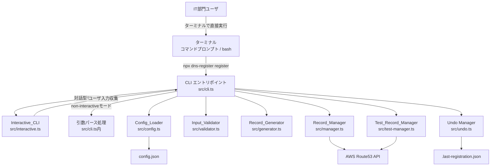
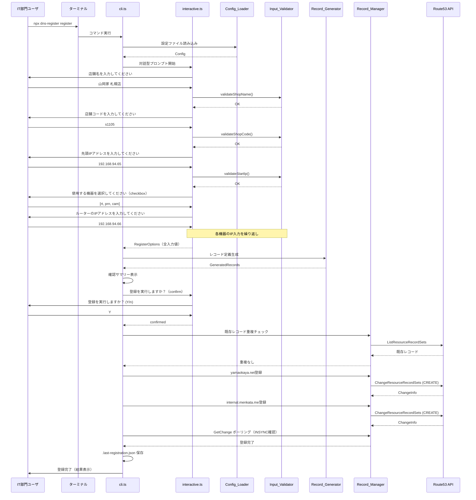
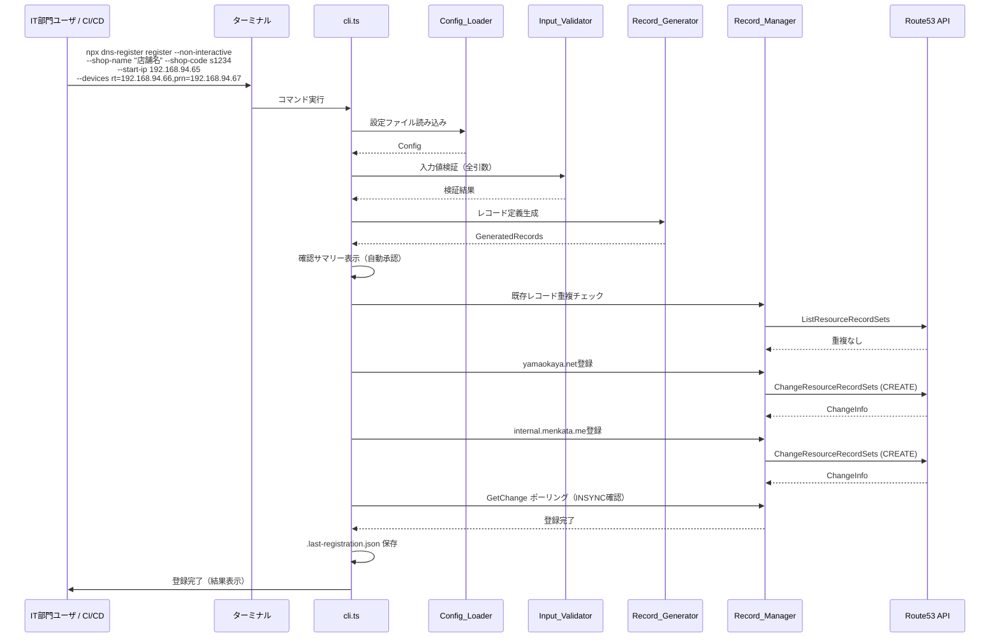
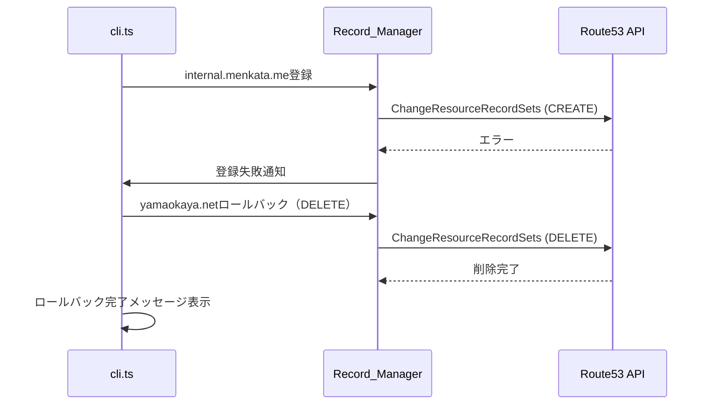
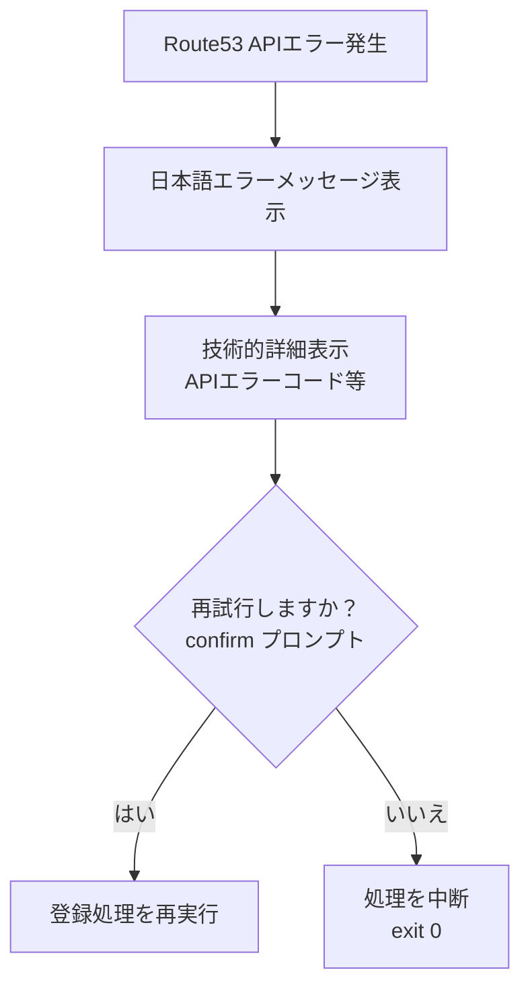

# 設計書: Route53 DNS登録CLIツール

## 概要

Route53 DNS登録CLIツール（DNS_CLI_Tool）は、IT部門のユーザがローカル環境のターミナルで直接実行し、`@inquirer/prompts` による対話型プロンプトを通じて、店舗ごとのDNSレコードを2つのプライベートホストゾーン（`yamaokaya.net`、`internal.menkata.me`）に安全に登録するためのCLIツールである。

既存ツール（route53-dns-auto-register）からの主な変更点:
- Claude Code依存の完全除去。CLAUDE.mdは不要
- 対象ユーザをIT部門のユーザに変更（ITリテラシーがある前提）
- `@inquirer/prompts` を使用した対話型CLIプロンプトの追加（`src/interactive.ts`）
- non-interactiveモード（`--non-interactive`）の追加（CI/CD連携・スクリプト実行用）
- `package.json` の `bin` フィールド定義（`npx dns-register register` で実行可能）
- READMEにIT部門向けの使用方法を記載

ツールは以下のコマンドを提供する:
- `register` — 対話型プロンプトで新規店舗のDNSレコード登録
- `register --test` — テストモードでレコードを登録
- `register --non-interactive` — コマンドライン引数のみで登録（CI/CD連携用）
- `undo` — 直前の登録の取り消し（30分以内）
- `list-tests` / `delete-tests` — テストレコードの一覧表示・一括削除

設計方針:
- 1コマンド = 1実行で完結（常駐プロセスなし）
- ユーザがターミナルで直接CLIを実行する形式（AI仲介なし）
- すべての出力メッセージは日本語
- 最小限のコード量で安全性を確保
- 各ファイルは単一責務とし、500行以内に収める
- 外部ライブラリの依存は最小限（AWS SDK v3 + @inquirer/prompts）
- 可読性を最優先とし、コメントは日本語で記述する
- 既存のビジネスロジック（config.ts, validator.ts, generator.ts, manager.ts, test-manager.ts, undo.ts）はそのまま維持

## アーキテクチャ

### 全体構成



### ディレクトリ構成

```
project-root/
├── src/
│   ├── cli.ts              # CLIエントリポイント（コマンド解析・実行フロー制御）
│   ├── interactive.ts      # Interactive_CLI（@inquirer/prompts による対話型プロンプト）【新規】
│   ├── config.ts           # Config_Loader（設定ファイル読み込み・検証）【既存維持】
│   ├── validator.ts        # Input_Validator（入力値バリデーション）【既存維持】
│   ├── generator.ts        # Record_Generator（レコード定義生成）【既存維持】
│   ├── manager.ts          # Record_Manager（Route53 API操作・登録・ロールバック）【既存維持】
│   ├── test-manager.ts     # Test_Record_Manager（テストレコード管理）【既存維持】
│   ├── undo.ts             # Undo Manager（取り消し機能）【既存維持】
│   └── types.ts            # 型定義【既存維持】
├── config.json             # 設定ファイル（Git管理対象）
├── iam-policy.json         # IAMポリシー定義
├── README.md               # IT部門向けセットアップ・使用方法【書き換え】
├── setup.bat               # Windowsセットアップスクリプト【既存維持】
├── setup.sh                # macOS/Linuxセットアップスクリプト【既存維持】
├── package.json            # binフィールド追加【変更】
├── tsconfig.json
└── .gitignore
```

変更対象ファイルの概要:
- `src/interactive.ts` — 新規作成。`@inquirer/prompts` を使用した対話型プロンプトモジュール
- `src/cli.ts` — 変更。対話型/non-interactiveモードの分岐、binエントリポイント対応（shebang追加）
- `package.json` — 変更。`bin` フィールド追加、`@inquirer/prompts` 依存追加、パッケージ名変更
- `README.md` — 書き換え。IT部門向けの使用方法に変更（Claude Code関連の記述を削除）
- `CLAUDE.md` — 削除

### 処理フロー

#### registerコマンド（対話型モード）



#### registerコマンド（non-interactiveモード）



#### ロールバックフロー（2ゾーン目失敗時）




## コンポーネントとインターフェース

### 1. CLI エントリポイント (`src/cli.ts`)【変更】

コマンドライン引数を解析し、対話型/non-interactiveモードの分岐とフロー制御を担当する。
既存の `cli.ts` をベースに、以下の変更を加える:

- ファイル先頭に shebang（`#!/usr/bin/env node`）を追加（`bin` フィールド対応）
- `register` コマンドで `--non-interactive` フラグがない場合は `interactive.ts` の対話型フローを呼び出す
- `--non-interactive` フラグがある場合は既存の引数パース処理で実行
- `undo` コマンドに対話型確認（inquirer confirm）を追加
- `delete-tests` コマンドに対話型確認を追加
- エラー発生時の再試行確認（inquirer confirm）を追加

```typescript
#!/usr/bin/env node

// コマンド定義
type Command = 'register' | 'list-tests' | 'delete-tests' | 'undo';

// エントリポイント
async function main(): Promise<void> {
  const command = process.argv[2] as Command;
  const args = parseArgs(process.argv.slice(3));

  switch (command) {
    case 'register':
      if (args['non-interactive']) {
        await handleRegisterNonInteractive(args);
      } else {
        await handleRegisterInteractive(args);
      }
      break;
    case 'undo':
      await handleUndo();
      break;
    case 'list-tests':
      await handleListTests();
      break;
    case 'delete-tests':
      await handleDeleteTests();
      break;
    default:
      // ヘルプ表示
  }
}
```

設計判断:
- コマンドライン引数の解析には外部ライブラリを使用せず、`process.argv` を直接パースする（既存実装を維持）
- 対話型モードとnon-interactiveモードの分岐は `--non-interactive` フラグで判定
- `--test` フラグは両モードで使用可能

### 2. Interactive_CLI (`src/interactive.ts`)【新規】

`@inquirer/prompts` を使用した対話型プロンプトモジュール。ユーザからの入力収集と即時バリデーションを担当する。

```typescript
import { input, checkbox, confirm } from '@inquirer/prompts';
import { validateShopName, validateShopCode, validateStartIp, validateDeviceIps } from './validator';
import type { Config } from './types';

/** 対話型プロンプトで収集した入力値 */
interface InteractiveInput {
  shopName: string;
  shopCode: string;
  startIp: string;
  devices: Record<string, string>;
}

/**
 * registerコマンドの対話型フロー
 * 以下の順序でプロンプトを表示する:
 * (1) 店舗名の入力（input型、バリデーション付き）
 * (2) 店舗コードの入力（input型、バリデーション付き）
 * (3) 先頭IPアドレスの入力（input型、バリデーション付き）
 * (4) 使用する機器の選択（checkbox型、日本語名称付き）
 * (5) 選択した各機器のIPアドレス入力（input型、バリデーション付き）
 */
async function promptRegisterInput(config: Config): Promise<InteractiveInput>;

/**
 * 登録実行の確認プロンプト
 * @returns true: 実行する、false: 中止する
 */
async function promptConfirmRegistration(): Promise<boolean>;

/**
 * エラー発生時の再試行確認プロンプト
 * @returns true: 再試行する、false: 中断する
 */
async function promptRetryOnError(): Promise<boolean>;

/**
 * undo実行の確認プロンプト
 * @returns true: 取り消す、false: 中止する
 */
async function promptConfirmUndo(): Promise<boolean>;

/**
 * テストレコード一括削除の確認プロンプト
 * @returns true: 削除する、false: 中止する
 */
async function promptConfirmDeleteTests(): Promise<boolean>;
```

設計判断:
- `@inquirer/prompts` の `input` 型に `validate` オプションを渡し、不正入力時に即座に日本語エラーメッセージを表示して再入力を求める
- `checkbox` 型で機器選択を実装。`choices` に `config.aliases` から日本語名称付きの選択肢を生成
- 機器選択で0件の場合は `validate` で「少なくとも1つの機器を選択してください」を返す
- 選択された機器のIPアドレス入力は `for...of` ループで順番に `input` プロンプトを表示
- Ctrl+C による中断は `@inquirer/prompts` が自動的に `ExitPromptError` をスローするため、`cli.ts` 側でキャッチして安全に終了する

### 3. Config_Loader (`src/config.ts`)【既存維持】

```typescript
interface Config {
  yamaokayaZoneId: string;
  menkataZoneId: string;
  region: string;
  aliases: AliasDefinition[];
  ttl: {
    aRecord: number;       // デフォルト: 300
    cnameAlias: number;    // デフォルト: 3600
    menkataCname: number;  // デフォルト: 300
  };
}

function loadConfig(configPath?: string): Config;
```

変更なし。既存実装をそのまま使用する。

### 4. Input_Validator (`src/validator.ts`)【既存維持】

```typescript
interface ValidationResult {
  valid: boolean;
  error?: string; // 日本語エラーメッセージ
}

function validateShopName(name: string): ValidationResult;
function validateShopCode(code: string): ValidationResult;
function validateStartIp(ip: string): ValidationResult;
function validateDeviceIps(
  devices: Record<string, string>,
  startIp: string,
  aliases: AliasDefinition[]
): ValidationResult;
```

変更なし。既存実装をそのまま使用する。
`interactive.ts` から各バリデーション関数を呼び出し、`validate` オプションに渡す。

### 5. Record_Generator (`src/generator.ts`)【既存維持】

```typescript
function generateRecords(
  shopCode: string,
  startIp: string,
  devices: Record<string, string>,
  config: Config,
  testPrefix?: string
): GeneratedRecords;
```

変更なし。既存実装をそのまま使用する。

### 6. Record_Manager (`src/manager.ts`)【既存維持】

```typescript
class RecordManager {
  constructor(private route53Client: Route53Client);
  async checkDuplicateShopCode(shopCode: string, zoneId: string): Promise<boolean>;
  async registerRecords(records: GeneratedRecords, config: Config, testMode?: boolean): Promise<RegistrationResult>;
  async rollbackYamaokaya(records: DnsRecord[], zoneId: string): Promise<void>;
  async waitForSync(changeId: string, timeoutMs?: number): Promise<boolean>;
  async deleteRecords(records: GeneratedRecords, config: Config): Promise<void>;
}
```

変更なし。既存実装をそのまま使用する。

### 7. Test_Record_Manager (`src/test-manager.ts`)【既存維持】

```typescript
class TestRecordManager {
  constructor(private route53Client: Route53Client);
  static readonly TEST_PREFIX = '__dns_auto_test-';
  async listTestRecords(zoneId: string): Promise<DnsRecord[]>;
  async deleteAllTestRecords(config: Config): Promise<{
    deletedCount: number;
    failedCount: number;
    failures: Array<{ name: string; reason: string }>;
  }>;
}
```

変更なし。既存実装をそのまま使用する。

### 8. Undo Manager (`src/undo.ts`)【既存維持】

```typescript
function saveLastRegistration(data: LastRegistration): void;
function loadLastRegistration(): LastRegistration | null;
function isWithinUndoWindow(registeredAt: string, windowMinutes?: number): boolean;
```

変更なし。既存実装をそのまま使用する。

### 9. package.json の変更

```json
{
  "name": "dns-register",
  "version": "2.0.0",
  "description": "Route53 DNS登録CLIツール - 店舗ごとのDNSレコードを登録するCLIツール",
  "main": "dist/cli.js",
  "bin": {
    "dns-register": "dist/cli.js"
  },
  "scripts": {
    "build": "tsc",
    "postinstall": "tsc",
    "test": "vitest --run"
  },
  "dependencies": {
    "@aws-sdk/client-route-53": "^3.700.0",
    "@inquirer/prompts": "^7.0.0"
  },
  "devDependencies": {
    "@types/node": "^25.5.2",
    "typescript": "^5.7.0",
    "vitest": "^3.0.0"
  },
  "engines": {
    "node": ">=22.0.0"
  }
}
```

変更点:
- `name`: `route53-dns-auto-register` → `dns-register`（`npx dns-register` で実行可能にするため）
- `version`: `1.0.0` → `2.0.0`（メジャーバージョンアップ: Claude Code依存除去の破壊的変更）
- `bin`: `{ "dns-register": "dist/cli.js" }` を追加
- `dependencies`: `@inquirer/prompts` を追加


## データモデル

### config.json（既存維持）

```json
{
  "yamaokayaZoneId": "ZPS49ZOFSRKVC",
  "menkataZoneId": "Z06858143PXEUA7VN6S4G",
  "region": "ap-northeast-1",
  "ttl": {
    "aRecord": 300,
    "cnameAlias": 3600,
    "menkataCname": 300
  },
  "aliases": [
    { "type": "rt", "displayName": "ルーター" },
    { "type": "prn", "displayName": "プリンター" },
    { "type": "cam", "displayName": "カメラ" },
    { "type": "ap", "displayName": "アクセスポイント" },
    { "type": "dl", "displayName": "デリシャス端末" },
    { "type": "enc1", "displayName": "エンコーダー1" },
    { "type": "enc2", "displayName": "エンコーダー2" },
    { "type": "ps", "displayName": "POSサーバー" }
  ]
}
```

### .last-registration.json（undo用、.gitignore対象、既存維持）

```json
{
  "shopCode": "s1234",
  "shopName": "テスト店",
  "registeredAt": "2026-04-15T10:30:00.000Z",
  "records": {
    "yamaokayaARecords": [
      { "name": "ip192-168-094-065.s1234.yamaokaya.net", "type": "A", "value": "192.168.94.65", "ttl": 300 }
    ],
    "yamaokayaCnameAliases": [
      { "name": "rt.s1234.yamaokaya.net", "type": "CNAME", "value": "ip192-168-094-066.s1234.yamaokaya.net", "ttl": 3600 }
    ],
    "menkataCnameRecords": [
      { "name": "ip192-168-094-065.internal.menkata.me", "type": "CNAME", "value": "ip192-168-094-065.s1234.yamaokaya.net", "ttl": 300 }
    ]
  }
}
```

### 型定義（`src/types.ts`、既存維持）

```typescript
interface AliasDefinition {
  type: string;
  displayName: string;
}

interface Config {
  yamaokayaZoneId: string;
  menkataZoneId: string;
  region: string;
  aliases: AliasDefinition[];
  ttl: { aRecord: number; cnameAlias: number; menkataCname: number; };
}

interface DnsRecord {
  name: string;
  type: 'A' | 'CNAME';
  value: string;
  ttl: number;
}

interface GeneratedRecords {
  yamaokayaARecords: DnsRecord[];
  yamaokayaCnameAliases: DnsRecord[];
  menkataCnameRecords: DnsRecord[];
}

interface ValidationResult {
  valid: boolean;
  error?: string;
}

interface RegistrationResult {
  success: boolean;
  yamaokayaChangeId?: string;
  menkataChangeId?: string;
  recordCount: number;
  error?: string;
}

interface LastRegistration {
  shopCode: string;
  shopName: string;
  registeredAt: string;
  records: GeneratedRecords;
}
```

### レコード命名規則（既存維持）

| レコード種別 | ゾーン | 命名パターン | 例 |
|---|---|---|---|
| Aレコード | yamaokaya.net | `ip192-168-{oct3:3桁}-{oct4:3桁}.{shopCode}.yamaokaya.net` | `ip192-168-094-065.s1105.yamaokaya.net` |
| CNAMEエイリアス | yamaokaya.net | `{deviceType}.{shopCode}.yamaokaya.net` | `rt.s1105.yamaokaya.net` |
| CNAME | internal.menkata.me | `ip192-168-{oct3:3桁}-{oct4:3桁}.internal.menkata.me` | `ip192-168-094-065.internal.menkata.me` |
| テストAレコード | yamaokaya.net | `__dns_auto_test-ip192-168-{oct3}-{oct4}.{shopCode}.yamaokaya.net` | `__dns_auto_test-ip192-168-094-065.s9999.yamaokaya.net` |
| テストCNAMEエイリアス | yamaokaya.net | `__dns_auto_test-{deviceType}.{shopCode}.yamaokaya.net` | `__dns_auto_test-rt.s9999.yamaokaya.net` |
| テストmenkata CNAME | internal.menkata.me | `__dns_auto_test-ip192-168-{oct3}-{oct4}.internal.menkata.me` | `__dns_auto_test-ip192-168-094-065.internal.menkata.me` |

### Route53 ChangeBatch リクエスト構造（既存維持）

yamaokaya.netゾーンへの登録例:

```json
{
  "HostedZoneId": "ZPS49ZOFSRKVC",
  "ChangeBatch": {
    "Comment": "DNS Auto Register: yamaokaya.net",
    "Changes": [
      {
        "Action": "CREATE",
        "ResourceRecordSet": {
          "Name": "ip192-168-094-065.s1234.yamaokaya.net",
          "Type": "A",
          "TTL": 300,
          "ResourceRecords": [{ "Value": "192.168.94.65" }]
        }
      },
      {
        "Action": "CREATE",
        "ResourceRecordSet": {
          "Name": "rt.s1234.yamaokaya.net",
          "Type": "CNAME",
          "TTL": 3600,
          "ResourceRecords": [{ "Value": "ip192-168-094-066.s1234.yamaokaya.net" }]
        }
      }
    ]
  }
}
```

### IPアドレス生成ロジック（既存維持）

先頭IP `192.168.X.Y` から62件を生成:
- `192.168.X.Y` （1件目）
- `192.168.X.Y+1` （2件目）
- ...
- `192.168.X.Y+61` （62件目）

制約: `Y + 61 ≤ 254`（第4オクテットが255を超えない）


## 正当性プロパティ（Correctness Properties）

*プロパティとは、システムのすべての有効な実行において成立すべき特性や振る舞いのことである。人間が読める仕様と、機械で検証可能な正当性保証の橋渡しとなる。*

prework分析の結果、以下の8つのプロパティを特定した。既存のビジネスロジック（validator.ts, generator.ts, undo.ts）は純粋関数であり、入力空間が広いため、プロパティベーステストが有効である。

### Property 1: 店舗名バリデーションの正当性

*For any* 文字列について、許可された文字種（漢字・ひらがな・カタカナ・半角/全角英数字・半角/全角スペース・長音記号・中黒）のみで構成され、かつ1文字以上30文字以下である場合に限り、`validateShopName` は `valid: true` を返す。それ以外の文字列（制御文字、HTMLタグ、31文字以上等）に対しては `valid: false` と日本語エラーメッセージを返す。

**Validates: Requirements 2.1, 2.7**

### Property 2: 店舗コードバリデーションの正当性

*For any* 文字列について、`validateShopCode` が `valid: true` を返すのは、その文字列が正規表現 `^s\d{1,6}$` にマッチする場合に限る。

**Validates: Requirements 2.2**

### Property 3: 先頭IPアドレスフォーマットバリデーションの正当性

*For any* 文字列について、`validateStartIp` がフォーマットエラーを返さないのは、その文字列が `192.168.X.Y` 形式（X: 0-255, Y: 0-255）である場合に限る。

**Validates: Requirements 2.3**

### Property 4: サブネット境界バリデーションの正当性

*For any* 有効な `192.168.X.Y` 形式のIPアドレスについて、`validateStartIp` がサブネット境界エラーを返すのは、`Y + 61 > 254` の場合に限る。

**Validates: Requirements 2.4**

### Property 5: 機器IPアドレスバリデーションの正当性

*For any* 先頭IPアドレス `192.168.X.Y` と機器IPアドレスの集合について、`validateDeviceIps` が `valid: true` を返すのは、すべての機器IPが `192.168.X.[Y, Y+61]` の範囲内であり、かつ重複するIPアドレスが存在しない場合に限る。

**Validates: Requirements 2.5, 2.6**

### Property 6: レコード生成の正当性

*For any* 有効な店舗コード、先頭IPアドレス、機器マップについて、`generateRecords` は以下を満たすレコード群を生成する:
- yamaokaya.net Aレコードが正確に62件生成され、各レコード名が `ip192-168-{oct3:3桁}-{oct4:3桁}.{shopCode}.yamaokaya.net` の命名規則に従う
- yamaokaya.net CNAMEエイリアスが機器数と同数生成され、各エイリアスが対応するAレコード名を参照する
- internal.menkata.me CNAMEレコードが正確に62件生成され、各レコードが対応するyamaokaya.net Aレコード名を参照する
- 合計レコード数が `62 + 機器数 + 62` と一致する

**Validates: Requirements 4.1, 4.2, 4.3, 4.4**

### Property 7: テストプレフィックスの適用

*For any* 有効な入力について、テストプレフィックス（`__dns_auto_test-`）を指定して `generateRecords` を呼び出した場合、生成されるすべてのレコード名が `__dns_auto_test-` で始まる。また、テストプレフィックスなしで同じ入力から生成されるレコード名とは一切重複しない。

**Validates: Requirements 6.1, 6.2**

### Property 8: 取り消し期限判定の正当性

*For any* ISO 8601形式の登録日時文字列と現在時刻について、`isWithinUndoWindow` が `true` を返すのは、登録日時から現在時刻までの経過時間が30分以内（1,800,000ミリ秒以下）の場合に限る。

**Validates: Requirements 7.8**

## エラーハンドリング

### エラー分類と対応方針

| エラー分類 | 対応方針 | 対話型モード | non-interactiveモード |
|---|---|---|---|
| 入力バリデーションエラー | 即座に日本語エラーメッセージを表示し再入力を求める | inquirer validate で即時フィードバック | エラーメッセージ表示 + exit(1) |
| 設定ファイルエラー | 具体的な不正箇所を表示して終了 | 同左 | 同左 |
| AWS認証エラー | 認証状態に応じたメッセージを表示 | 同左 | 同左 |
| Route53 APIエラー | エラー詳細を表示、再試行を提案 | confirm プロンプトで再試行/中断を選択 | エラーメッセージ表示 + exit(1) |
| ロールバック失敗 | 緊急メッセージを表示（手動対応が必要） | 同左 | 同左 |
| Ctrl+C中断 | 安全に終了、レコード未登録の旨を表示 | ExitPromptError をキャッチ | シグナルハンドラで対応 |

### Ctrl+C ハンドリング

`@inquirer/prompts` は Ctrl+C 時に `ExitPromptError` をスローする。`cli.ts` のメインエントリポイントでこの例外をキャッチし、以下のメッセージを表示して安全に終了する:

```typescript
try {
  await main();
} catch (error) {
  if (error instanceof Error && error.name === 'ExitPromptError') {
    console.log('\n処理を中断しました。レコードは登録されていません。');
    process.exit(0);
  }
  throw error;
}
```

### AWS認証エラーの判定（既存ロジック維持）

既存の `getAwsAuthErrorMessage` 関数をそのまま使用する。以下のエラーパターンを判定:
- `CredentialsProviderError` / `Could not load credentials` → 認証未設定
- `ExpiredTokenException` / `AccessDeniedException` 等 → 認証情報の期限切れ・無効

### エラー発生時の再試行フロー（対話型モードのみ）



non-interactiveモードでは再試行プロンプトを表示せず、エラーメッセージを出力して `exit(1)` で終了する。

## テスト戦略

### テストフレームワーク

- ユニットテスト / プロパティベーステスト: Vitest
- プロパティベーステストライブラリ: `fast-check`（Vitest と組み合わせて使用）

### テスト構成

```
project-root/
├── src/
│   ├── __tests__/
│   │   ├── validator.test.ts      # バリデーション関数のプロパティテスト + ユニットテスト
│   │   ├── generator.test.ts      # レコード生成のプロパティテスト + ユニットテスト
│   │   ├── undo.test.ts           # 取り消し期限判定のプロパティテスト
│   │   ├── config.test.ts         # 設定読み込みのユニットテスト
│   │   ├── interactive.test.ts    # 対話型プロンプトのユニットテスト（inquirerモック）
│   │   └── cli.test.ts            # CLIコマンドルーティングのユニットテスト
```

### プロパティベーステスト

各プロパティテストは `fast-check` を使用し、最低100回のイテレーションで実行する。
各テストにはコメントで設計書のプロパティ番号を参照する。

タグ形式: `Feature: route53-dns-cli-tool, Property {number}: {property_text}`

対象プロパティ:
1. Property 1: 店舗名バリデーション — ランダム文字列生成、許可/拒否の判定
2. Property 2: 店舗コードバリデーション — ランダム文字列生成、正規表現マッチング
3. Property 3: 先頭IPフォーマットバリデーション — ランダムIP文字列生成
4. Property 4: サブネット境界バリデーション — ランダム第4オクテット生成
5. Property 5: 機器IPバリデーション — ランダムIP集合生成、範囲・重複チェック
6. Property 6: レコード生成の正当性 — ランダム入力からのレコード生成、件数・命名規則・参照整合性の検証
7. Property 7: テストプレフィックス適用 — プレフィックス有無での生成比較
8. Property 8: 取り消し期限判定 — ランダムタイムスタンプ生成、30分境界の検証

### ユニットテスト

プロパティテストでカバーしきれない以下の領域をユニットテストで補完する:

- 設定ファイル読み込み（正常系、ファイル不在、JSON不正、必須フィールド不足）
- 対話型プロンプトのフロー（inquirerモック使用、プロンプト順序の検証）
- CLIコマンドルーティング（各コマンドの振り分け）
- AWS認証エラー判定（各エラーパターンの検出）
- エラーメッセージの日本語出力

### インテグレーションテスト

Route53 APIとの統合テストは、モックを使用して以下を検証する:

- 登録順序（yamaokaya.net → internal.menkata.me）
- ロールバック動作（2ゾーン目失敗時の1ゾーン目削除）
- GetChange ポーリング動作
- 重複チェック動作
- テストレコードの一覧取得・一括削除

