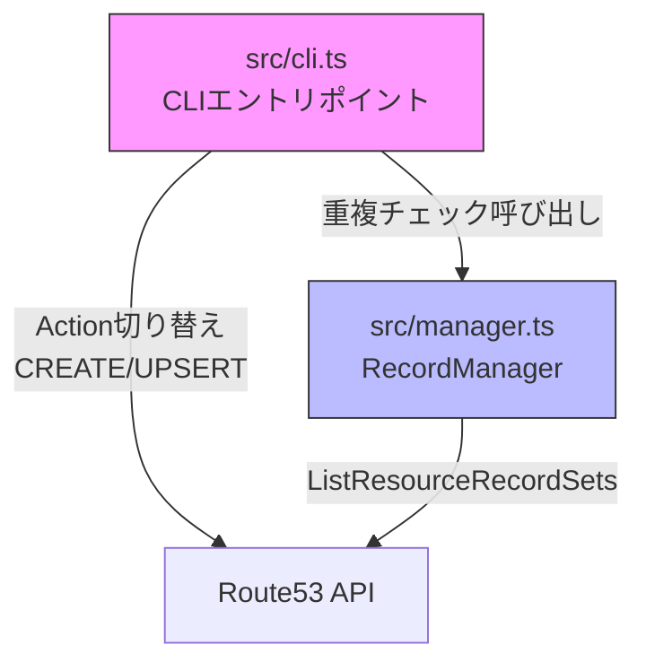
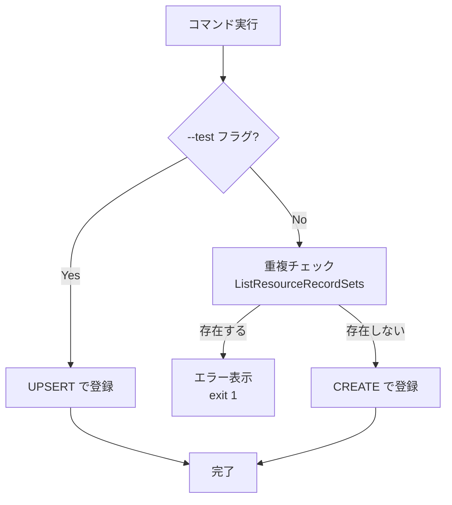

# Design Document: test-mode-safety

## Overview

DNS自動登録ツールにおいて、`add-device` と `encode-name` コマンドの本番モード安全性を強化する。

現状の問題:
- `add-device` コマンドは本番モードでも常に UPSERT を使用しており、既存CNAMEレコードを意図せず上書きするリスクがある
- `encode-name` コマンドも同様に常に UPSERT を使用しており、既存TXTレコードを上書きするリスクがある

設計方針:
- `create-records` コマンドで確立済みの「本番時 CREATE / テスト時 UPSERT」パターンを `add-device` と `encode-name` に統一適用する
- 重複チェックは `RecordManager` に新メソッドを追加し、既存の `checkDuplicateShopCode` と同様のアプローチで実装する

## Architecture

### 変更対象モジュールと責務



### 処理フロー



## Components and Interfaces

### 1. RecordManager への新メソッド追加（src/manager.ts）

既存の `checkDuplicateShopCode` と同様のパターンで、特定レコードの存在確認メソッドを追加する。

```typescript
/**
 * 指定されたCNAMEレコードが既に存在するか確認する
 * @param recordName 確認対象のFQDN（例: "rt.s001.yamaokaya.net"）
 * @param zoneId ホストゾーンID
 * @returns 存在する場合 true
 */
async checkDuplicateCname(recordName: string, zoneId: string): Promise<boolean>

/**
 * 指定されたTXTレコードが既に存在するか確認する
 * @param recordName 確認対象のFQDN（例: "s001.yamaokaya.net"）
 * @param zoneId ホストゾーンID
 * @returns 存在する場合 true
 */
async checkDuplicateTxt(recordName: string, zoneId: string): Promise<boolean>
```

実装方針:
- `ListResourceRecordSetsCommand` で `StartRecordName` を指定し、対象レコード名に絞り込む
- レスポンスの `ResourceRecordSets` から完全一致 + タイプ一致で判定する
- `checkDuplicateShopCode` がサフィックス検索（全件走査）なのに対し、新メソッドは `StartRecordName` による効率的な前方一致検索を使用する

### 2. CLI ハンドラの変更（src/cli.ts）

#### handleAddDevice の変更

```typescript
// 本番モード時: 重複チェック + CREATE
if (!testMode) {
  const manager = new RecordManager(route53);
  const isDuplicate = await manager.checkDuplicateCname(cnameRecordName, yamaokayaZoneId);
  if (isDuplicate) {
    console.error('このCNAMEレコードは既に登録されています。');
    process.exit(1);
  }
}
const action = testMode ? 'UPSERT' : 'CREATE';
// ChangeResourceRecordSetsCommand の Action を action 変数で指定
```

#### handleEncodeName の変更

```typescript
// 本番モード時: 重複チェック + CREATE
if (!testMode) {
  const manager = new RecordManager(route53);
  const isDuplicate = await manager.checkDuplicateTxt(txtRecordName, yamaokayaZoneId);
  if (isDuplicate) {
    console.error('このTXTレコードは既に登録されています。');
    process.exit(1);
  }
}
const action = testMode ? 'UPSERT' : 'CREATE';
// ChangeResourceRecordSetsCommand の Action を action 変数で指定
```

## Data Models

### 既存型への変更: なし

本機能では新しい型定義は不要。既存の `DnsRecord`, `Config`, `RecordManager` の型はそのまま使用する。

### Route53 API レスポンス（参考）

重複チェックで使用する `ListResourceRecordSets` のレスポンス構造:

```typescript
// ListResourceRecordSetsCommand のレスポンス（関連部分のみ）
{
  ResourceRecordSets: [
    {
      Name: "rt.s001.yamaokaya.net.",  // 末尾ドット付きFQDN
      Type: "CNAME",                    // レコードタイプ
      TTL: 3600,
      ResourceRecords: [{ Value: "..." }]
    }
  ],
  IsTruncated: boolean,
  NextRecordName?: string,
  NextRecordType?: string
}
```

注意点:
- Route53 は FQDN の末尾にドット（`.`）を付与して返す
- 比較時はドットの有無を正規化する必要がある


## Correctness Properties

*A property is a characteristic or behavior that should hold true across all valid executions of a system-essentially, a formal statement about what the system should do. Properties serve as the bridge between human-readable specifications and machine-verifiable correctness guarantees.*

### Property 1: 重複チェックの正検出（Duplicate detection correctness）

*For any* valid record name, record type (CNAME or TXT), and any set of Route53 ResourceRecordSets, the duplicate check function SHALL return `true` if and only if the set contains a record whose normalized name matches the query name and whose type matches the query type.

ここで「normalized name」とは、Route53 が返す末尾ドット付き FQDN（例: `rt.s001.yamaokaya.net.`）とドットなし FQDN（例: `rt.s001.yamaokaya.net`）を同一視する正規化を指す。

**Validates: Requirements 1.2, 2.2**

### Property 2: モード別アクション選択の排他性（Mode-action exclusivity）

*For any* コマンド実行（add-device または encode-name）において、testMode フラグの値に対して、Route53 API に送信される Action は以下の排他的対応を満たす:
- `testMode === true` ならば `Action === 'UPSERT'` かつ重複チェックは実行されない
- `testMode === false` ならば `Action === 'CREATE'` かつ重複チェックが実行される

**Validates: Requirements 1.3, 1.4, 2.3, 2.4**

## Error Handling

### 重複チェックエラー

| エラー条件 | メッセージ | 終了コード |
|---|---|---|
| add-device: CNAMEレコード重複 | 「このCNAMEレコードは既に登録されています。」 | 1 |
| encode-name: TXTレコード重複 | 「このTXTレコードは既に登録されています。」 | 1 |

### Route53 API エラー

重複チェック時の `ListResourceRecordSets` API 呼び出しが失敗した場合:
- 既存の `getAwsAuthErrorMessage` / `isNetworkError` による分類を適用
- 認証エラー・ネットワークエラーは既存のエラーハンドリングフローで処理される
- 重複チェック自体の API エラーは上位の try-catch で捕捉され、既存のエラーメッセージ表示ロジックに委譲する

## Testing Strategy

### Property-Based Testing

プロパティベーステストライブラリ: **fast-check**（TypeScript 向け PBT ライブラリ）

各プロパティテストは最低100イテレーション実行する。

| Property | テスト対象 | 生成する入力 |
|---|---|---|
| Property 1 | `checkDuplicateCname`, `checkDuplicateTxt` | ランダムなレコード名、ランダムな ResourceRecordSets 配列 |
| Property 2 | `handleAddDevice`, `handleEncodeName` のアクション選択ロジック | testMode: boolean、ランダムな店舗コード・デバイス名・IP |

タグ形式: `Feature: test-mode-safety, Property {number}: {property_text}`

### Unit Tests（Example-Based）

| テストケース | 検証内容 |
|---|---|
| add-device 本番モード: 重複あり | エラーメッセージ表示、exit 1 |
| add-device 本番モード: 重複なし | CREATE アクションで登録 |
| add-device テストモード | UPSERT、重複チェックスキップ |
| encode-name 本番モード: 重複あり | エラーメッセージ表示、exit 1 |
| encode-name 本番モード: 重複なし | CREATE アクションで登録 |
| encode-name テストモード | UPSERT、重複チェックスキップ |

### テスト実装方針

- Route53Client はモックを使用（`ListResourceRecordSetsCommand` のレスポンスを制御）
- `process.exit` はモック化して終了コードを検証
- 既存の `create-records` コマンドのテストパターンがあれば、それに準拠する
