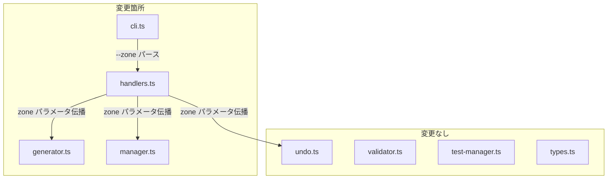
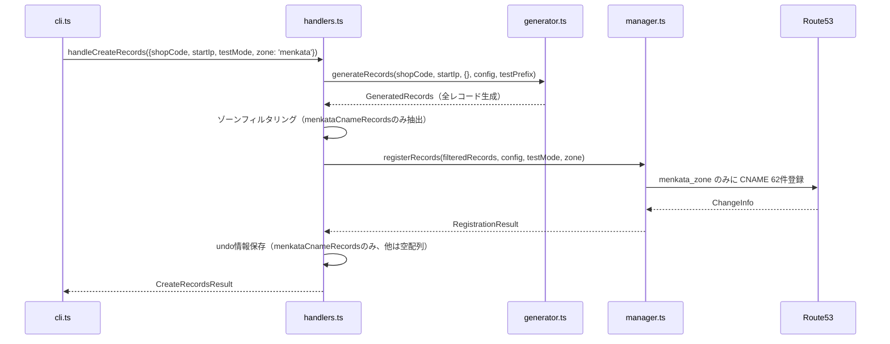
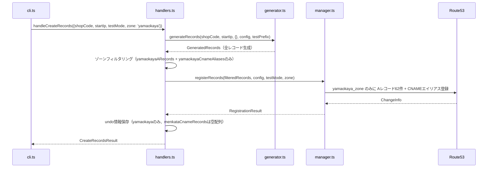

# Design Document: Zone Selective Registration

## Overview

`create-records` コマンドに `--zone` オプションを追加し、yamaokaya.net / internal.menkata.me のいずれか一方のゾーンのみにレコードを登録できるようにする。これにより、段階的な登録ワークフロー（先にyamaokaya.netに登録し、後からmenkata.meを追加）が可能になる。

本機能は既存の `handlers.ts` の業務ロジック層と `cli.ts` のCLIエントリポイント層に変更を加え、`generator.ts` のレコード生成ロジックにゾーンフィルタリング機能を追加する。`manager.ts` の登録処理にはゾーン選択に応じた条件分岐を導入する。

### 設計方針

- **後方互換性の維持**: `--zone` オプション未指定時は従来どおり両ゾーン同時登録
- **最小限の変更**: 既存モジュールのインターフェースを極力変更せず、新しいパラメータの追加で対応
- **型安全性**: ゾーン指定値を型で制約し、不正値をコンパイル時に検出

## Architecture

### 変更対象モジュールと責務



### 処理フロー（--zone menkata 指定時）



### 処理フロー（--zone yamaokaya 指定時）



## Components and Interfaces

### 新規型定義（types.ts に追加）

```typescript
/** ゾーン選択値 */
export type ZoneSelection = 'yamaokaya' | 'menkata';

/** create-records ハンドラの入力（拡張） */
export interface CreateRecordsParams {
  shopCode: string;
  startIp: string;
  testMode: boolean;
  zone?: ZoneSelection;  // 新規追加
}

/** encode-name ハンドラの入力（拡張） */
export interface EncodeNameParams {
  shopName: string;
  shopCode: string;
  testMode: boolean;
  zone?: ZoneSelection;  // 新規追加（encode-nameはyamaokayaのみだが統一性のため）
}

/** add-device ハンドラの入力（拡張） */
export interface AddDeviceParams {
  shopCode: string;
  device: string;
  ip: string;
  testMode: boolean;
  zone?: ZoneSelection;  // 新規追加（add-deviceはyamaokayaのみだが統一性のため）
}
```

### cli.ts の変更

```typescript
/** --zone オプションのバリデーション */
function validateZoneOption(value: string | boolean | undefined): ZoneSelection | undefined {
  if (value === undefined || value === true) return undefined;
  if (value === 'yamaokaya' || value === 'menkata') return value;
  // 不正値の場合はエラー出力して終了
  console.error(`--zone の値が正しくありません: "${value}"。有効な値: yamaokaya, menkata`);
  process.exit(1);
}
```

### handlers.ts の変更

#### handleCreateRecords の変更点

1. `params.zone` を受け取り、重複チェックの対象ゾーンを制御
2. レコード生成後、`zone` に応じて `GeneratedRecords` をフィルタリング
3. `manager.registerRecords` に `zone` パラメータを伝播
4. undo情報保存時、未登録ゾーンのレコード配列を空配列に設定

```typescript
/** ゾーン選択に基づいてGeneratedRecordsをフィルタリングする */
function filterRecordsByZone(
  records: GeneratedRecords,
  zone?: ZoneSelection
): GeneratedRecords {
  if (!zone) return records; // 未指定時は全レコード
  if (zone === 'yamaokaya') {
    return {
      yamaokayaARecords: records.yamaokayaARecords,
      yamaokayaCnameAliases: records.yamaokayaCnameAliases,
      menkataCnameRecords: [],
    };
  }
  // zone === 'menkata'
  return {
    yamaokayaARecords: [],
    yamaokayaCnameAliases: [],
    menkataCnameRecords: records.menkataCnameRecords,
  };
}
```

#### handleEncodeName の変更点

- `--zone menkata` が指定された場合: encode-nameはyamaokaya.netのTXTレコードのみを扱うため、`--zone menkata` 指定時はエラーを返す
- `--zone yamaokaya` または未指定: 従来どおりの動作

#### handleAddDevice の変更点

- `--zone menkata` が指定された場合: add-deviceはyamaokaya.netのCNAMEレコードのみを扱うため、`--zone menkata` 指定時はエラーを返す
- `--zone yamaokaya` または未指定: 従来どおりの動作

### manager.ts の変更

#### registerRecords の変更点

```typescript
async registerRecords(
  records: GeneratedRecords,
  config: Config,
  testMode?: boolean,
  zone?: ZoneSelection  // 新規追加
): Promise<RegistrationResult>
```

- `zone === 'yamaokaya'`: yamaokaya_zone のみに登録、menkata_zone への登録をスキップ
- `zone === 'menkata'`: menkata_zone のみに登録、yamaokaya_zone への登録をスキップ
- `zone === undefined`: 従来どおり両ゾーンに登録（ロールバック動作も維持）

### 重複チェックの変更

| zone指定 | 重複チェック対象 |
|---------|-------------|
| 未指定 | yamaokaya_zone の Aレコード（従来動作） |
| `yamaokaya` | yamaokaya_zone の Aレコード |
| `menkata` | menkata_zone の CNAMEレコード（新規メソッド追加） |

#### 新規メソッド: checkDuplicateMenkataCname

```typescript
/** menkata_zone 内の同一店舗コードのCNAMEレコードが既に存在するか確認する */
async checkDuplicateMenkataCname(shopCode: string, zoneId: string): Promise<boolean> {
  const command = new ListResourceRecordSetsCommand({
    HostedZoneId: zoneId,
    StartRecordName: `${shopCode}.internal.menkata.me`,
  });
  const response = await this.route53Client.send(command);
  const suffix = `.internal.menkata.me.`;
  // 店舗コードを含むCNAMEレコードの存在を確認
  return (response.ResourceRecordSets ?? []).some((rrs) =>
    rrs.Name?.includes(`.${shopCode}.`) || rrs.Name?.includes(`${shopCode}.internal.menkata.me`)
  );
}
```

## Data Models

### GeneratedRecords（変更なし）

既存の `GeneratedRecords` 型はそのまま使用する。ゾーン選択時は該当しないフィールドを空配列にすることで対応する。

```typescript
interface GeneratedRecords {
  yamaokayaARecords: DnsRecord[];      // zone='menkata'時は空配列
  yamaokayaCnameAliases: DnsRecord[];  // zone='menkata'時は空配列
  menkataCnameRecords: DnsRecord[];    // zone='yamaokaya'時は空配列
}
```

### UndoEntry（変更なし）

既存の `UndoEntry` 型の `generatedRecords` フィールドをそのまま使用する。ゾーン選択時は未登録ゾーンのレコード配列を空配列として保存する。

```typescript
// 例: --zone yamaokaya で登録した場合のundo情報
{
  operationId: "op_1234_abc",
  toolType: "create-records",
  shopCode: "s1105",
  registeredAt: "2024-01-15T10:30:00.000Z",
  undone: false,
  generatedRecords: {
    yamaokayaARecords: [...],       // 62件
    yamaokayaCnameAliases: [...],   // 機器数分
    menkataCnameRecords: []         // 空配列（未登録）
  }
}
```

### RegistrationResult（変更なし）

既存の型をそのまま使用。ゾーン選択時は該当しないChange IDが `undefined` になる。

```typescript
// 例: --zone menkata で登録した場合
{
  success: true,
  yamaokayaChangeId: undefined,  // yamaokayaには登録していない
  menkataChangeId: "/change/C1234",
  recordCount: 62
}
```


## Correctness Properties

*A property is a characteristic or behavior that should hold true across all valid executions of a system-essentially, a formal statement about what the system should do. Properties serve as the bridge between human-readable specifications and machine-verifiable correctness guarantees.*

### Property 1: ゾーンフィルタリングの正確性

*For any* valid shopCode, startIp, and zone selection ('yamaokaya' or 'menkata'), `filterRecordsByZone` を適用した結果は、指定ゾーンに対応するレコード配列のみが非空であり、未指定ゾーンのレコード配列は空配列であること。具体的には:
- zone='yamaokaya' の場合: yamaokayaARecords.length > 0 かつ menkataCnameRecords.length === 0
- zone='menkata' の場合: menkataCnameRecords.length > 0 かつ yamaokayaARecords.length === 0 かつ yamaokayaCnameAliases.length === 0

**Validates: Requirements 1.2, 1.3, 3.2, 3.3**

### Property 2: デフォルト動作の保全

*For any* valid shopCode and startIp, zone が undefined の場合、`filterRecordsByZone` を適用した結果は元の GeneratedRecords と同一であり、yamaokayaARecords、yamaokayaCnameAliases、menkataCnameRecords の全てが非空であること。

**Validates: Requirements 1.1, 4.5**

### Property 3: 不正ゾーン値の拒否

*For any* string that is neither 'yamaokaya' nor 'menkata'（空文字列、数値文字列、類似文字列を含む）、ゾーンバリデーション関数は不正値として拒否すること。

**Validates: Requirements 1.4, 2.5, 7.4**

### Property 4: menkata CNAMEレコードの参照先正確性

*For any* valid shopCode and startIp, 生成された menkataCnameRecords の各レコードの value（CNAME参照先）は、同じ shopCode と startIp から算出される yamaokaya Aレコード名（`ip192-168-{oct3:3桁}-{oct4:3桁}.{shopCode}.yamaokaya.net` 形式）と一致すること。

**Validates: Requirements 3.1**

### Property 5: undo情報のゾーン選択反映

*For any* valid shopCode, startIp, and zone selection, 保存される UndoEntry の generatedRecords は、指定ゾーンに対応するレコード配列のみが非空であり、未指定ゾーンのレコード配列は空配列であること。zone が undefined の場合は全配列が非空であること。

**Validates: Requirements 4.1, 4.2, 4.5**

### Property 6: undo削除の空配列スキップ

*For any* GeneratedRecords において一部の配列が空配列である場合、deleteRecords 操作は空配列に対応するゾーンへの DELETE リクエストを送信せず、非空配列に対応するゾーンのみを削除対象とすること。

**Validates: Requirements 4.3**

### Property 7: 重複検出時の登録中止

*For any* shopCode and zone selection, 指定ゾーン内で重複が検出された場合、handleCreateRecords は success=false を返し、Route53 への登録 API コールを実行しないこと。

**Validates: Requirements 2.3**

### Property 8: テストモードとゾーン選択の組み合わせ

*For any* valid shopCode, startIp, zone selection, and testMode=true の組み合わせにおいて、登録されるレコードは全てテストプレフィックス（`auto_dns_test_`）を持ち、かつ指定ゾーンに対応するレコードのみであること。テストレコード情報ファイルに保存されるレコードも同様に指定ゾーンのレコードのみであること。

**Validates: Requirements 6.1, 6.2**

## Error Handling

### エラーケース一覧

| エラーケース | 対応 | メッセージ |
|------------|------|----------|
| `--zone` に不正値 | CLI層で即座に終了 | `--zone の値が正しくありません: "{value}"。有効な値: yamaokaya, menkata` |
| `--zone menkata` + encode-name | ハンドラ層でエラー返却 | `encode-name コマンドは yamaokaya ゾーンのみに対応しています。` |
| `--zone menkata` + add-device | ハンドラ層でエラー返却 | `add-device コマンドは yamaokaya ゾーンのみに対応しています。` |
| 指定ゾーン内で重複検出 | ハンドラ層でエラー返却 | `この店舗コードのレコードは既に登録されています。` |
| menkata登録失敗（zone未指定時） | yamaokayaロールバック | `登録処理の途中でエラーが発生したため、登録済みのレコードをすべて取り消しました。` |
| menkata登録失敗（zone=menkata時） | エラー返却のみ | `レコードの登録に失敗しました。IT部門に連絡してください。` |
| ロールバック失敗 | 例外スロー | `レコードの取り消しに失敗しました。至急IT部門に連絡してください。` |
| undo中のAPI失敗 | undoneフラグ維持 | `レコードの取り消しに失敗しました。IT部門に連絡してください。` |

### ロールバック戦略

- **zone未指定時**: 従来どおり、menkata登録失敗時にyamaokayaをロールバック
- **zone='yamaokaya'時**: menkata登録を行わないため、ロールバック不要。yamaokaya登録失敗時はそのままエラー返却
- **zone='menkata'時**: yamaokaya登録を行わないため、ロールバック不要。menkata登録失敗時はそのままエラー返却

## Testing Strategy

### テストフレームワーク

- **ユニットテスト / プロパティテスト**: Vitest + fast-check（既存プロジェクトで使用済み）
- **テスト実行**: `vitest --run`

### プロパティベーステスト

プロパティベーステストは `fast-check` を使用し、各プロパティにつき最低100回のイテレーションを実行する。

対象となる純粋関数:
1. `filterRecordsByZone` — ゾーンフィルタリングロジック（Property 1, 2）
2. `validateZoneOption` — ゾーンバリデーション（Property 3）
3. `generateRecords` — CNAME参照先の正確性（Property 4）

各テストには以下のタグ形式でコメントを付与する:
```
// Feature: zone-selective-registration, Property {number}: {property_text}
```

### ユニットテスト（example-based）

以下のシナリオをカバーする:
- 重複チェックのゾーンスコーピング（Requirements 2.1, 2.2, 2.4）
- ロールバック動作の維持（Requirements 5.1, 5.2, 5.3, 5.4）
- テストモードとの互換性（Requirements 6.3, 6.4）
- 出力メッセージのフォーマット（Requirements 7.1, 7.2, 7.3, 7.5）
- encode-name / add-device での --zone menkata 拒否

### モック戦略

- Route53Client の `send` メソッドをモック化（既存テストパターンに準拠）
- ファイルI/O（undo情報、テストレコード情報）はモック化せず、一時ファイルを使用
- `appendUndoEntry` / `saveTestRecords` はスパイで呼び出し引数を検証

### テストファイル構成

```
src/
├── zone-filter.test.ts              # Property 1, 2: filterRecordsByZone のプロパティテスト
├── zone-validation.test.ts          # Property 3: validateZoneOption のプロパティテスト
├── zone-cname-reference.test.ts     # Property 4: CNAME参照先のプロパティテスト
├── zone-undo.test.ts                # Property 5, 6: undo情報のプロパティテスト
├── zone-duplicate-check.test.ts     # Property 7: 重複チェックのプロパティテスト
├── zone-test-mode.test.ts           # Property 8: テストモード組み合わせのプロパティテスト
└── zone-integration.test.ts         # ユニットテスト（ロールバック、出力、エラー処理）
```
