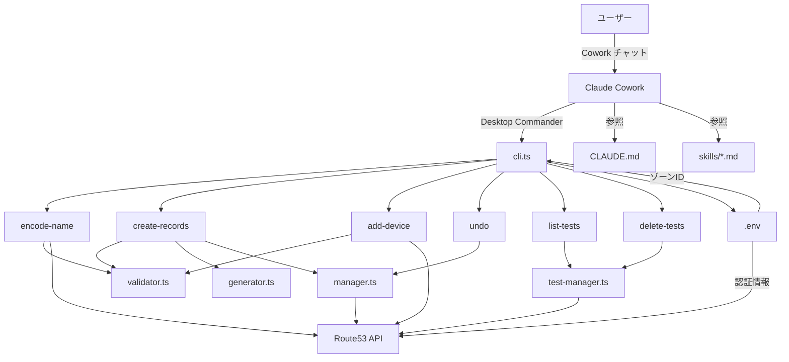
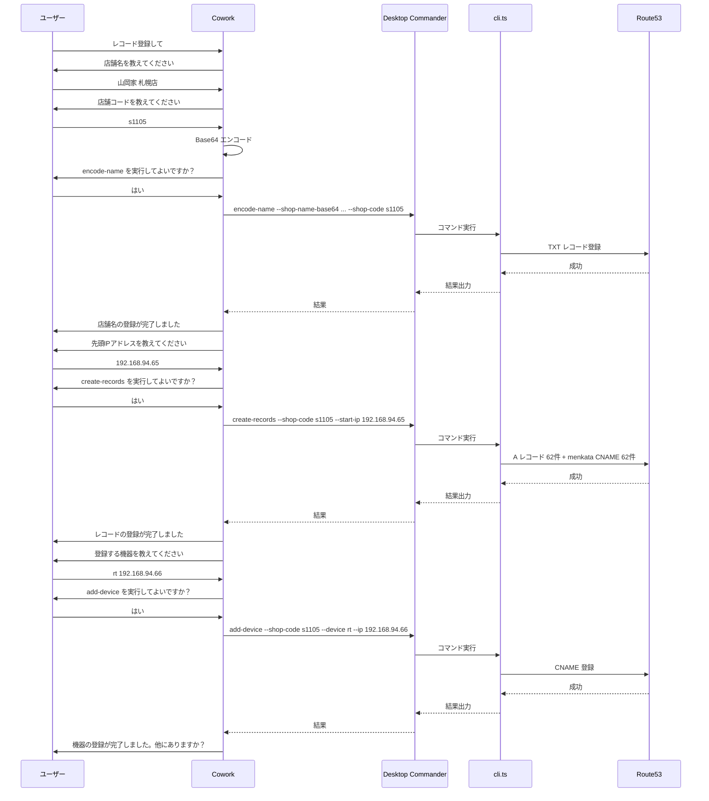

# ソフトウェア構造図

## 全体構成



## ファイル構成

```
dns-register/
├── src/
│   ├── cli.ts           # CLI エントリポイント（全コマンドのハンドラ）
│   ├── validator.ts     # 入力バリデーション（店舗名・コード・IP）
│   ├── generator.ts     # DNS レコード生成（A レコード・CNAME）
│   ├── manager.ts       # Route53 API 操作（登録・削除・同期確認）
│   ├── test-manager.ts  # テストレコード管理（一覧・一括削除）
│   ├── undo.ts          # undo 情報の保存・読み込み・期限チェック
│   ├── config.ts        # 設定読み込み（レガシー、.env に移行済み）
│   └── types.ts         # 型定義
├── skills/
│   ├── register-skill.md       # 本番登録スキル
│   ├── register-test-skill.md  # テスト登録スキル
│   ├── undo-skill.md           # 取り消しスキル
│   └── delete-tests-skill.md   # テスト削除スキル
├── CLAUDE.md            # Cowork 用ガイド・ルール
├── README.md            # ユーザー向け + IT部門向けドキュメント
├── .env                 # AWS認証情報・ゾーンID・リージョン
├── setup.bat            # Windows セットアップ
├── setup.sh             # macOS/Linux セットアップ
├── package.json
└── tsconfig.json
```

## コマンドフロー


