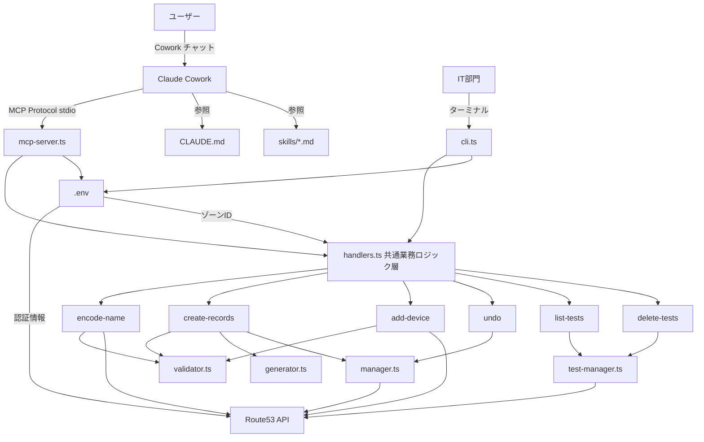
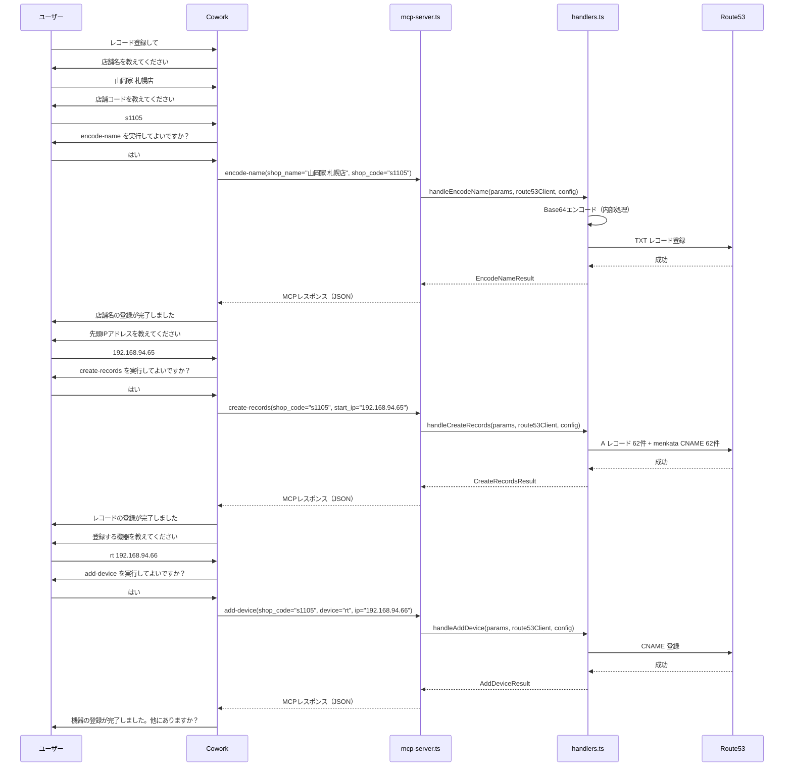
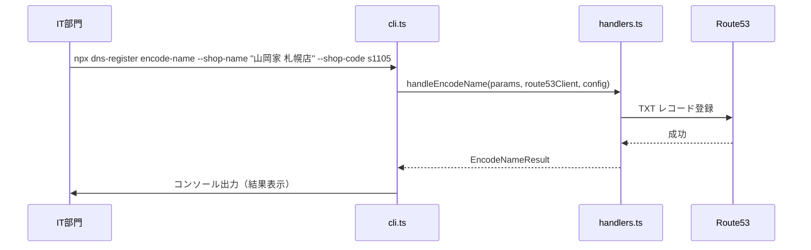

# ソフトウェア構造図

## 全体構成



## レイヤー構成

```
┌─────────────────────────────────────────────┐
│  エントリポイント層                            │
│  ┌──────────────┐  ┌──────────────────────┐  │
│  │ mcp-server.ts│  │ cli.ts               │  │
│  │ (MCP Protocol)│  │ (コマンドライン)       │  │
│  └──────┬───────┘  └──────────┬───────────┘  │
│         │                     │              │
│         ▼                     ▼              │
│  ┌──────────────────────────────────────┐    │
│  │ handlers.ts  共通業務ロジック層        │    │
│  │ - handleEncodeName()                 │    │
│  │ - handleCreateRecords()              │    │
│  │ - handleAddDevice()                  │    │
│  │ - handleUndo()                       │    │
│  │ - handleListTests()                  │    │
│  │ - handleDeleteTests()                │    │
│  └──────────────┬───────────────────────┘    │
│                 │                            │
│  ┌──────────────▼───────────────────────┐    │
│  │ 既存モジュール層（変更なし）            │    │
│  │ validator.ts | generator.ts          │    │
│  │ manager.ts   | test-manager.ts       │    │
│  │ undo.ts      | types.ts             │    │
│  └──────────────────────────────────────┘    │
└─────────────────────────────────────────────┘
```

## ファイル構成

```
dns-register/
├── src/
│   ├── mcp-server.ts    # MCPサーバー エントリポイント（stdioトランスポート）
│   ├── cli.ts           # CLI エントリポイント（IT部門向けローカル実行）
│   ├── handlers.ts      # 共通業務ロジック層（全ハンドラ関数）
│   ├── validator.ts     # 入力バリデーション（店舗名・コード・IP）
│   ├── generator.ts     # DNS レコード生成（A レコード・CNAME）
│   ├── manager.ts       # Route53 API 操作（登録・削除・同期確認）
│   ├── test-manager.ts  # テストレコード管理（一覧・一括削除）
│   ├── undo.ts          # undo 情報の保存・読み込み・期限チェック
│   └── types.ts         # 型定義（ハンドラ入出力型を含む）
├── skills/
│   └── dns-register-skill.md  # MCPツール呼び出し手順スキル
├── CLAUDE.md            # Cowork 用ガイド・ルール
├── README.md            # ユーザー向け + IT部門向けドキュメント
├── .env                 # AWS認証情報・ゾーンID・リージョン
├── setup.bat            # Windows セットアップ
├── setup.sh             # macOS/Linux セットアップ
├── package.json
└── tsconfig.json
```

## コマンドフロー（MCPツール経由）



## コマンドフロー（CLIローカル実行）


